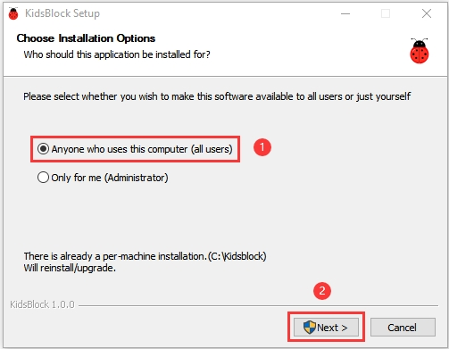
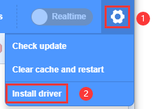
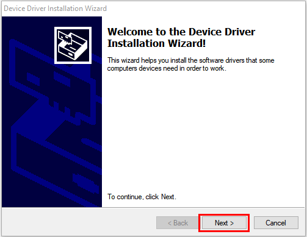
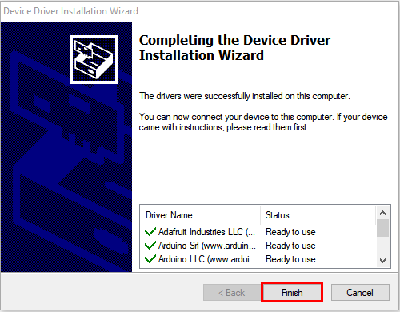
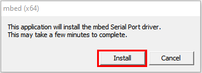
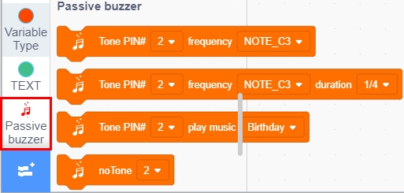
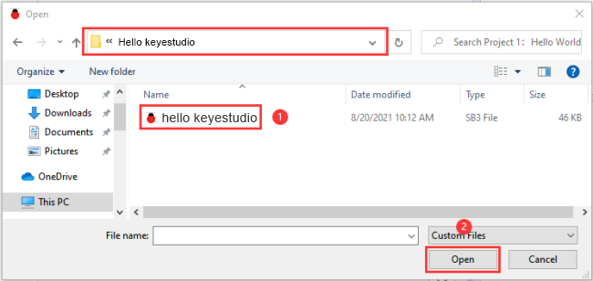

# **KidsBlock Software**

## **KidsBlock Software for Windows**

1. Download link：[http://xiazai.keyesrobot.cn/KidsBlock.exe](http://xiazai.keyesrobot.cn/KidsBlock.exe)

   

2. Double click “KidsBlock 1.1.4 Setup.exe”.

3. Tap “**Anyone who uses this computer(all users)**” and “**Next**”.

4. Click “**Browse...**” and choose the Disk where the software will be placed (here, we choose C Drive). Then click“**Install**”.

5. After a few seconds, the installation is complete. Click "Finish" to open the installed Kidsblock software.

6. If the computer security alert window appears, click “**Allow access**”.

## **KidsBlock Software for MacOS**

1. Download link： [http://xiazai.keyesrobot.cn/KidsBlock.dmg](http://xiazai.keyesrobot.cn/KidsBlock.dmg)

2. Double-click KidsBlock icon, then drag the KidsBlock Desktop to the **Applications** folder.

3. After the installation is finished, you will view the KidsBlock icon.

## How to Use Kidsblock

（**We will demonstrate how to use KidsBlock on Windows system**）

### 1. Interface：

### 2. Switch Languages

Clickto switch to different languages.

### 3. Install the Development Board and Driver

**Note: If the driver is not installed, as shown below:**

Clickto select “**Install driver**”.

A. Click “**Next**” at the **Device Driver Installation Wizard **page. 

B.  After a while, click “**Finish**”. 

C. Tap “**Next**”. 

D.  Enter “**Finish**”. 

E.  Then click “**Allow**” and “**Install**”. 

F. After a while, click“**Finish**”.

G. Select “**Extract**”.

H. Click “**Next**”.

I. Next, click “**I accept this agreement**” and “**Next**”.

J. Click “**Finish**”.

K. After a while, click “**INSTALL**”.

L. After a few seconds, when the driver is installed, just click “**OK**”.

### 4. Select the Development Board

Click to enter the main page, select the control board needed. In this project, we need to click “Kit” to add the “ESP32 Inventor Starter kit” and click **Connect,** then ESP32 board is connected.

Click **Go to Editor** to return the code editor. Icon  will change into  and will change into . This means the ESP32 mainboard and ports（COM) are connected.

### 5. Select the Port

If the **ESP32** mainboard is connected , but icon doesn’t change into . You need to click to connect the COM port.

 Click  and **Connect**, then you will find a page pop up, showing **Connected.**

To disconnect the port, just click  and **Disconnect**.

### 6. Kidsblock Interface：

### 7. Add Sensors and Modules 

stands for extension libraries of sensors and modules.

Click  to enter the page of extension libraries, click a sensor or module to add.

For example, if click the “passive buzzer” module,“**Not loaded**” will change into “**Loaded**”. Then the passive buzzer is added.

   

Click  to return to the code editor. Then you can view the passive buzzer in the blocks area.

 

If you want to delete the passive buzzer, click  to select the passive buzzer. Then “**Loaded**” will change into “**Not loaded**”. Then the passive buzzer is deleted.

    

The way of deleting other sensors or modules is as same as the passive buzzer.

### 8. How to Open SB3 Type Files

1. Double-click SB3 type files to open them.

For instance, to open , then we need to double-click it.(connect to the development board first)

2. Open Kidsblock，click **file and  Load from your computer**，then select the SB3 type file on the computer.（for example )

### 9. Upload Code and Set Baud Rate

#### 1. Upload Code

Add the code file to the Kidsblock software, connect the board to the computer (if the port is not shown, you need to install the driver, please check point 3 ), then select the port and click to wait for the upload to complete.

After uploading successfully, you will find that "Hello Keyestudio!" will be printed in the Kidsblock software interface.

#### 2. Set Baud Rate

If you don't see the print box in the lower right corner, then set the print box with these three buttons in the upper right corner.

small print box

large print box

no print box

If there is a print box but prints nothing or prints garbled characters, then click to set the baud rate to 9600.

