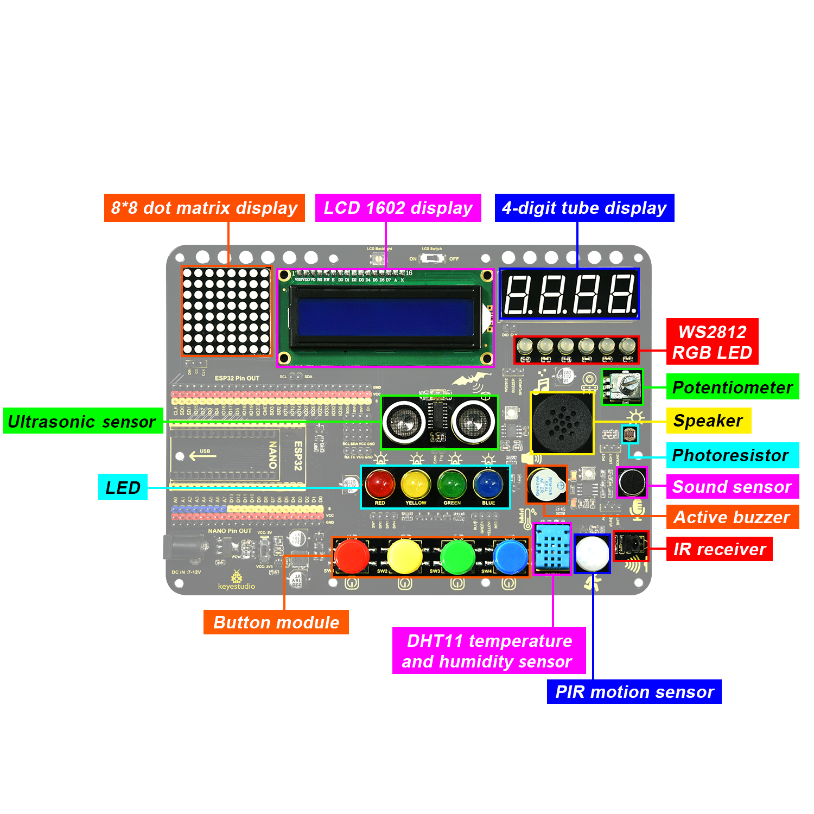
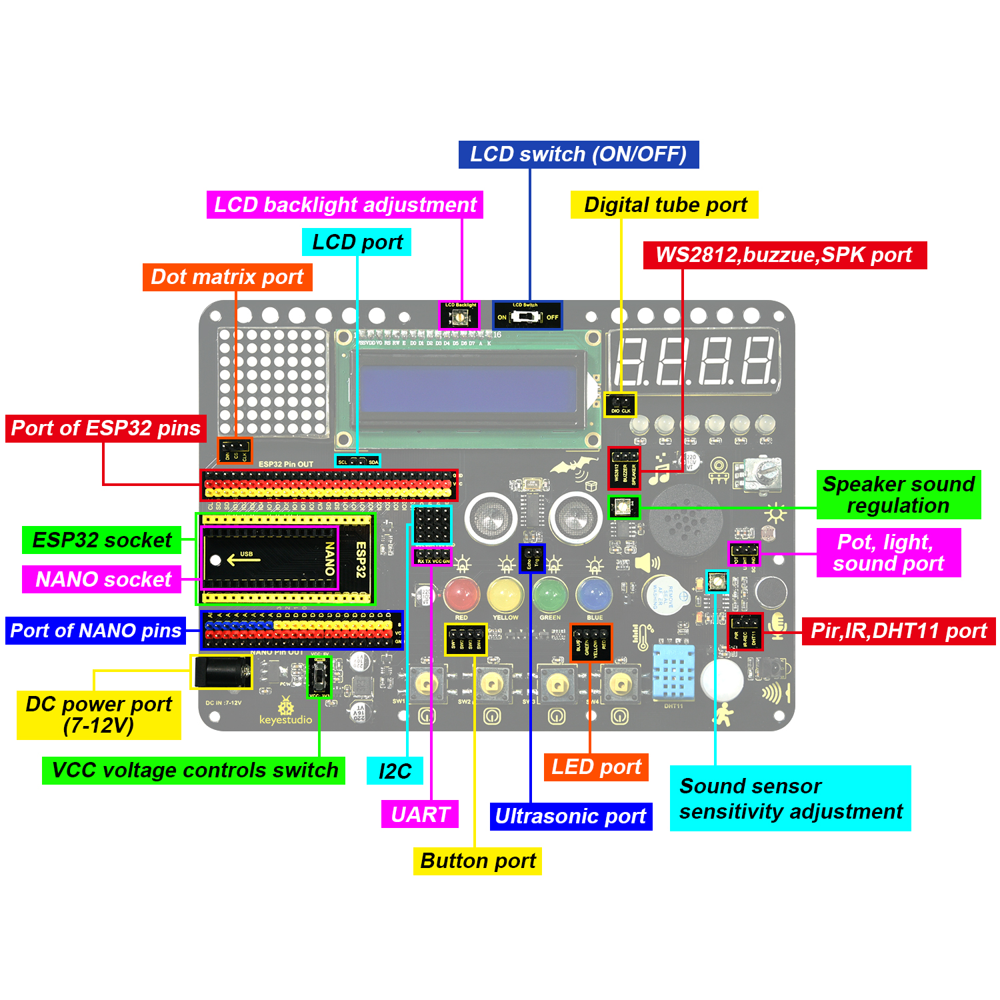

# **Inventor Learning Kit Expansion Board**

This expansion board is compatible with the Keyestudio Nano Plus development board and Keyestudio ESP32 development board. The voltage on VCC can be set to 3.3V (ESP32) or 5V(Nano) via a DIP switch.

It  integrates four buttons, four LEDs(red, yellow, green and blue), six WS2812 RGB LEDs, a buzzer, a PIR motion sensor, an IR receiver, a sound sensor, a photoresistor, a 8002 amplifier, a potentiometer, an ultrasonic sensor, a 4-bit digital tube display, a 8x8 dot matrix display and a LCD 1602 display. 

What's more, each pin possesses its own VCC and GND, which brings a higher compatibility to the board and provides more opportunities for extended learning of other modules. 

**Modules  Introduction**

**Pin out**

