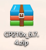
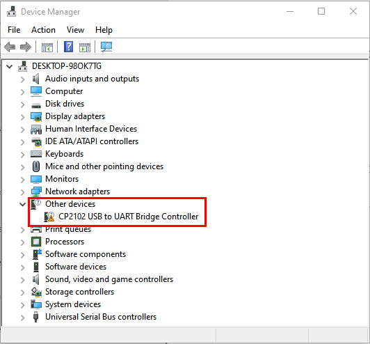
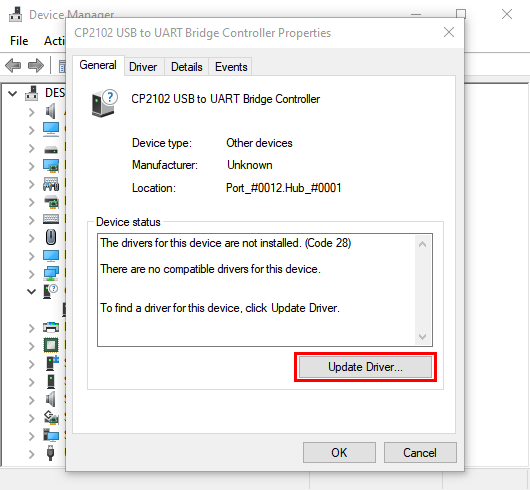
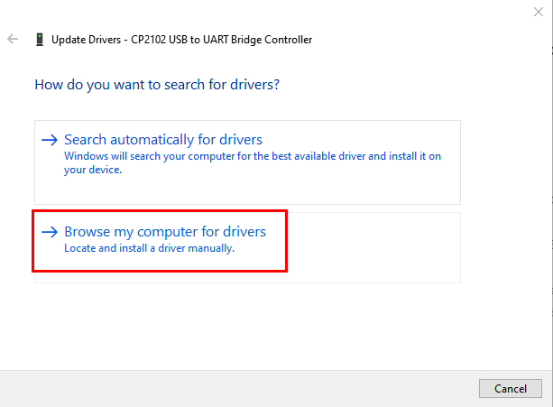
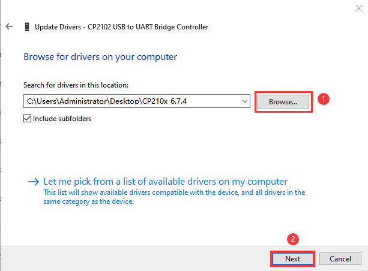
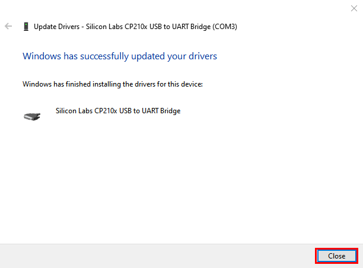
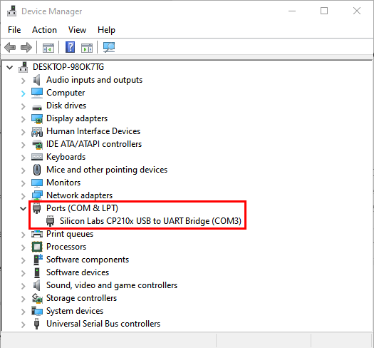

# **Install Development Board and Driver**

### **Windows System**

Connect the control board to computer via USB. For Windows 10, the driver will be automatically installed. For Windows 7 and others, you should install it manually. 

USB-to-serial port chip of the board is CP2102, and we need to install it.

Download Link of CP2102 Driver：[https://fs.keyestudio.com/CP2102-WIN](https://fs.keyestudio.com/CP2102-WIN)

Then will appear and unzip it.    --

If the control board is connected to your computer for the first time, please click Computer--Attributes--Device Manager:

If the CP2102 driver is not installed successfully, there is a yellow exclamation mark, tap and “**Update drive...**” to update the driver.

Click “**Browse my computer for drivers**”

Enter“**Browse...**” to find the folder, and tap “**Next**”.

Close the page after installation, and then the serial port number appears.

Finally, click Computer--Attributes--Device Manager:

### **MAC System**

Link: [https://wiki.keyestudio.com/How_to_Install_the_Driver_of_CP2102_on_MAC_System](https://wiki.keyestudio.com/How_to_Install_the_Driver_of_CP2102_on_MAC_System)

