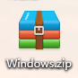

# **Install Development Software and Driver**

## **1.Arduino IDE Software**

### **1.1 Install Arduino IDE(Windows)**

Arduino official website：[https://www.arduino.cc/](https://www.arduino.cc/)

Enter the website and click **SOFTWARE** to download the latest Arduino software:

-1682391125819-2.png)

 Arduino boasts multiple versions such as Widows, mac and Linux(as shown below), please ensure that the one you download is compatible with your computer.

-1682391137129-4.png)

Here,  we will take Windows system as an example to introduce how to download and install it.

Two versions are provided for Windows: for installing and for downloading(a zipped file).

-1682391150989-6.png)

Click **JUST DOWNLOAD** to download the software. 

### **1.2 Install Arduino IDE(Mac)**

Its download method is similar to the Windows.

-1682391243691-8.png)

## **2.Install Development Board and Driver**

### **2.1 Windows System**

Connect the control board to computer via USB. For Windows 10, the driver will be automatically installed. For Windows 7 and others, you should install it manually. 

USB-to-serial port chip of the board is CP2102, and we need to install it.

Download Link of CP2102 Driver：[https://fs.keyestudio.com/CP2102-WIN](https://fs.keyestudio.com/CP2102-WIN)

Then will appear and unzip it.    --

If the control board is connected to your computer for the first time, please click Computer--Attributes--Device Manager:

If the CP2102 driver is not installed successfully, there is a yellow exclamation mark, tap and “**Update drive...**” to update the driver.

Click “**Browse my computer for drivers**”

Enter“**Browse...**” to find the folder, and tap “**Next**”.

Close the page after installation, and then the serial port number appears.

Finally, click Computer--Attributes--Device Manager:

### **2.2 MAC System**

Link: [https://wiki.keyestudio.com/How_to_Install_the_Driver_of_CP2102_on_MAC_System](https://wiki.keyestudio.com/How_to_Install_the_Driver_of_CP2102_on_MAC_System)

## **3.Install the Development Board**

Link for the ESP32 Development Board：[https://docs.espressif.com/projects/arduino-esp32/en/latest/getting_started.html#about-arduino-esp32](https://docs.espressif.com/projects/arduino-esp32/en/latest/getting_started.html#about-arduino-esp32)

### **3.1 Windows System**

Open the Arduino IDE

-1682391393081-31.png)

Click Tools→Board→ ESP32(we need to install it)

-1682391404286-33.png)

**Installation Steps of the ESP32：**

Tap “File》Preferences”，add the link“ **https://espressif.github.io/arduino-esp32/package_esp32_index.json**” in Additional boards manager URLs and click OK.

-1682391415970-35.png)

Select the iconto open the the board options

-1682391426145-37.png)

Search for ESP32 In the search box and click Install 

-1682391436611-39.png)

Choose the corresponding  port 

-1682391446503-41.png)

### **3.2 MAC System**

The setting method of Arduino IDE resembles that of Windows. The only difference is COM port:

-1682391456693-43.png)

Tap Arduino IDE 》Preferences，add the link“ **https://espressif.github.io/arduino-esp32/package_esp32_index.json**” in Additional boards manager URLs and click OK.

-1682391468738-45.png)

Search for ESP32 In the search box and click Install 

-1682391482368-47.png)

If you use an Apple laptop, slid the scroll bar on the right to the bottom, and the **"INSTALL" ** installation button can't be displayed, you need to adjust the  "**Interface scale**"  of the Arduino IDE.

-1682391491646-49.png)

Click **“Arduino IDE 》Preferences 》Interface scale”** to select the appropriate size until you see the **“INSTALL”** button.

-1682391501675-51.png)

## **4.Install Libraries**

### **4.1 What are Libraries?**

A library is a collection of codes, and it facilitates the connection of sensors, displays and modules. 

For instance, the LiquidCrystal library simplifies the communication with LCD display. Moreover, hundreds of libraries are available on Internet. In the reference, in-built and manually-added libraries are listed. 

### **4.2 How to Install the Libraries?**

Tap **Sketch>Include Library>Add .Zip Library...**

-1682391521591-53.png)

Select the zipped files you need and click ok to add a library. If success, the message bar will show “**Library installed**”.

-1682391534464-55-1682476920764-4.png)

For more tutorials, please visit our official website：[https://www.keyestudio.com/](https://www.keyestudio.com/)

------

