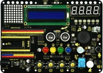
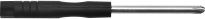
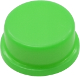
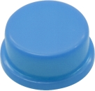

# Product Introduction
### **About Keyestudio**

Keyestudio is the best-selling brand owned by KEYES Corporation. Our product contains Arduino development boards, expansion boards, sensors and modules, Raspberry Pi, micro:bit expansion boards as well as smart cars, which can help customers at any level to learn about Arduino.

Notably, all of our products are in line with international quality standards and are greatly appreciated in a broad menu of different markets across the world.

Welcome to check out more contents from our official website:[http://www.keyestudio.com](http://www.keyestudio.com)

### **Obtain Information and After-sales Service**

1.Download address:[https://fs.keyestudio.com/FKS0001](https://fs.keyestudio.com/FKS0001)

2.If something is found missing or broken, or you have some difficulty learning the kit, please feel free to contact us. Welcome to send email to us: **service@keyestudio.com**
3.We will endeavor to update projects and products continuously from your sincere advice! Thanks!

### **Warning**

1.This product contains tiny parts(screws and copper pillars), so please keep out of reach of children to prevent from lacerations or accidental ingestion. For children under 8, please accompany with adults when using.

2.This product contains conductive parts(control board and electronic modules). Please operate according to the requirements of tutorials. Otherwise, improper operation may damage parts due to overheating. In this case, do not touch and immediately disconnect the circuit power.

### **Copyright**
The Keyestudio trademark and logo are the copyright of KEYES DIY ROBOT co.,LTD. All products under Keyestudio brand can’t be copied, sold or resold without authorization by anyone or company.

If you are interested in our products, please contact to our sales representatives: **fennie@keyestudio.com**

## **ESP32 Inventor Learning Kit**

### **1. Description**

This learning kit is a programmable tool specialized for kids above 6, which boasts 15 modules and sensors such as LEDs, buttons, a LCD, a photosensor, a sound sensor, an IR receiver, a temperature and humidity sensor as well as 30 interesting projects.

For your convenience, Arduino C language and graphical programming are provided, which empower to cultivate programming thinking.

### **2. Features**

**1. Easy wiring:** The wiring of VCC and GND are removed

**2. Multiple functions:** Nano or ESP32 development board are available as the control board and 15 sensors are integrated. When the external power supply is connected, the DIP switch can be used to control the VCC voltage to 3.3V or 5V.

**3. Simple structure:** Use 6mm dual-pass copper pillars to connect the acrylic board.

**4. High expansibility:** VCC and GNG pins are provided

**5.  Programming learning:** Arduino C language and graphical programming are available.

### **3. Parameters**

- **Working voltage:** 5V or 3.3V
- **DC power:** 7-12V

- **USB power:**  5V
- **Working current:** ≥35mA

- **Working temperature:** –10°C ~ +65°C

### **4. Kit**

|  #   | Picture                                              |             Components             | QTY  |
| :--: | :--------------------------------------------------- | :--------------------------------: | :--- |
|  1   |             |     Keyestudio Expansion Board     | 1    |
|  2   |              | Keyestudio ESP32 Development Board | 1    |
|  3   |              |           Battery Holder           | 1    |
|  4   |             |               Servo                | 1    |
|  5   |             |        Slotted Screwdriver         | 1    |
|  6   |             |        Phillips Screwdriver        | 1    |
|  7   |             |         IR Remote Control          | 1    |
|  8   |             |             USB Cable              | 1    |
|  9   |  |     M2.5*6MM Round Head Screw      | 22   |
|  10  |                  |  M2.5*9MM Dual-pass Copper Pillar  | 10   |
|  11  |                              |       20CM F-F DuPont Wires        | 20   |
|  12  |                              |       10CM F-F DuPont Wires        | 20   |
|  13  |                             |           Acrylic Board            | 1    |
|  14  |                  |             Rubber Pad             | 4    |
|  15  |                             |         Potentiometer Cap          | 1    |
|  16  |                             |           Red Button Cap           | 1    |
|  17  |            |          Green Button Cap          | 1    |
|  18  |            |         Yellow Button Cap          | 1    |
|  19  |            |          Blue Button Cap           | 1    |

