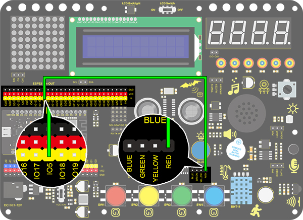
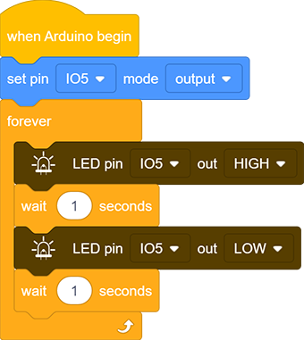

# **Project 1: LED Blinking**

###  **1. Description**

LED blinking is a simple project designed for starters. You only need to install an LED on Arduino board and upload the code on Arduino IDE. This project reinforces the learning of Arduino conceptual framework and using methods for starters. 

###  **2. Working Principle**

**LED:** Generally speaking, limited IO ports of output current may cause low brightness of LED, so a NPN triode (Q2) is applied in circuit as a switch. In this case, the LED will light up if the base(pin 1) of triode is at a high level. On the contrary, LED goes off when the base is at low. 

**Triode switch:** Briefly, LED lights up when the base(pin 1) is at a high level. In the same breath, the collector(pin 3) and emitter(pin 2) are connected, and then VCC passes through a current-limiting resistor to LED and finally to GND, which forms a circuit. On the contrary, LED goes off when the base is at low. In this circumstance, the collector and emitter are disconnected  and the LED lights off.

### **3. Wiring Diagram**

###  **4. Test Code**

According to previous principles, we can control LED via levels of pins on the development board.

1. Drag  the following block in "Events" part. 

2. Drag the following block  in "Control" part . 

3. Drag the following block  in "Pins" part and set the IO5 pin to output.

4. Drag the following block  in "LED" part and set the IO5 pin to HIGH.

5. Drag the following block  in "Control" part . 

6. Drag the following blocks and set the IO5 pin to LOW. 

**Complete Code：**

###  **5. Test Result**

After uploading the code and powering on, LED will be on for 1s and off for 1s.

### **6. Code Explanation**

**Note: Pin mode must be set to "output" ** **when using LED module**

1.Code blocks will not execute if the following block is not exist.

	2. Code blocks in  the following block will execute in a loop. 

2.It is a module used to set the pin mode(control LED and buzzer for “output” mode, and read sensor module for “input” ).

3.It is a module used to set the pin and the levels("HIGH" and "LOW").

4.It is a module used to set the delay time.

