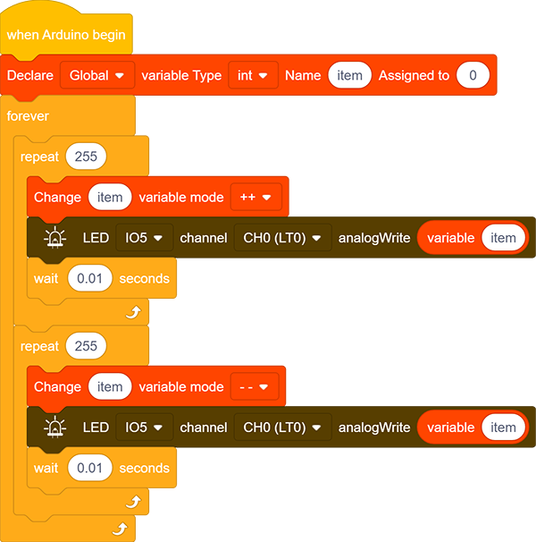

# **Project 2: Breathing LED**

### **1. Description**

Arduino breathing led utilizes on-board programmable PWM to output analog waveform. After powering on, LED brightness can be adjusted through duty cycle of the waveform to eventually realize the effect of breathing led. 
In this way, ambient light can be simulated by changing LED brightness over time. Also, breathing led can form a colorful mini light to construct a tranquil and warm environment.

### **2. What is PWM?**

PWM controls analog output via digital means, which is able to adjust duty cycle of the wave (a signal circularly shifting between high level and low level).

For Arduino, digital ports of voltage output are LOW and HIGH, which respectively correspond to 0V and 5V. Generally, we define LOW as 0 and HIGH as 1. Arduino will output 500 signals of 0 or 1 within 1s. If they are "1", 5V will be output. Oppositely, if they are all 0, the output will be 0V. Or if they are 010101010101..., the average output will be 2.5V. 

In other words, output ratio of 0 and 1 affects the voltage value, the more 0 and 1 signals are output per unit time, the more accurate the control will be. 

### **3. Wiring Diagram**

### **4. Test Code**

We adopt "for" statement to increase a variable from 0 to 255, and define the variable as PWM output (analogWrite(pin, value)). By the way, a delay time may reinforce the control of LED shining time. Next, we use another "for" statement to decrease it from 255 to 0 with a delay time to control LED dimming process. 

1. Drag the two code blocks.

2. Drag the following block from "Variables" part, and define the name to "item" with an initial assignment "0". Put this block in "forever" block. 

3. Drag  the following block from "Control" part and set it to 255 times, which is the maximum value of PWM.

4. Drag the following block from "Variables" part, put "item" as its changed object and set the mode to "++".

5. Drag the following block from “LED” part and set the LED pin to IO5. Then add an "variable" block in it and fill in the blank with "item". 

6. Drag the following block from "Control" part and set the time to 0.01s , that is 10ms. 

7. According to previous steps, build another code block with the only difference of variable mode "– –".

**Complete Code：**

### **5. Test Result**
After uploading the code, we can see the LED dims gradually. It "breathes" evenly.
### **6. Code Explanation**

1. This block is used to set variable usable range, variable type , name and its initial value.
   
2. Repeating times can be assigned in the blank of this repeat block. 
   
3. Input a variable name in the blank and its value will add 1 each time the code executes. "++" can be altered to "– –".
   
4. Input a variable name in the blank and its value will reduce 1 each time the code executes.  "– –" can be altered to "++" . 
   
5. This is a PWM output module, and the white box is the value of the output PWM.
   

