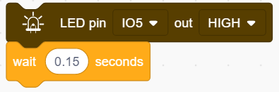
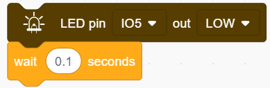
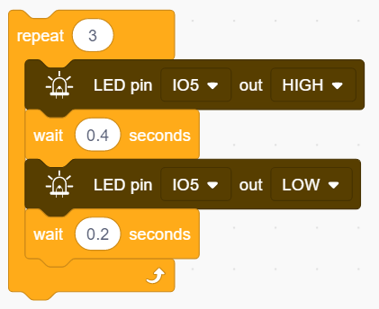
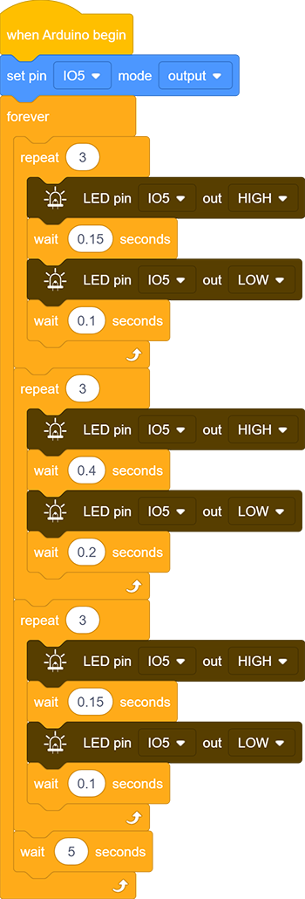

# **Project 3：SOS Distress Device**

### **1. Description**

SOS device is able to emit distress signals, which coincides with the principle of Morse code. It is convenient for emergencies.

### **2. Wiring Diagram**

### **3. Test Code**

What we should clear firstly is how SOS distress light blinks: LED quickly blinks 3 times for “S” and slowly blinks 3times for “O”. 
And then, we control the blinking times and duration via "for" statement and set interval time among letters. 

1. Drag the two code blocks.

2. Drag the following block  in "Pins" part and set the IO5 pin to output.

**Letter "S"**

3. Drag the following block from "Control" part and set to 3 times, as "S" means blink for 3 times. 

4. Drag the following blocks from "LED" part and set the IO5 pin to HIGH. Then set the delay time to 0.15s. 

5. Drag the following blocks from "LED" part and set the IO5 pin to LOW. Then set the delay time to 0.1s.  

**Letter O**

6. Refer to previous steps to build the following code blocks. Modify the HIGH ouput to delay 0.4s and LOW to 0.2s.   

**Letter S**

7. Operate step 3 ,4 and 5 again. 

8. Add a delay time of 5s to the end, and "SOS" will repeat every 5s.   

**Complete Code：**

### **4.Test Result**

After uploading the code, LED respectively blinks for 3 times quickly and slowly.

