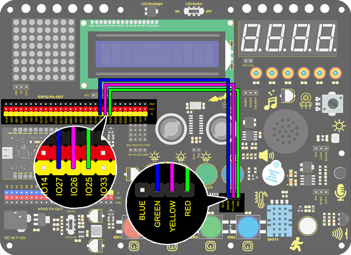
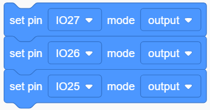
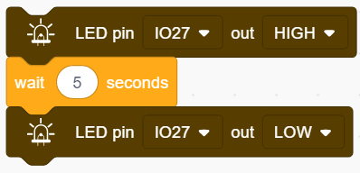
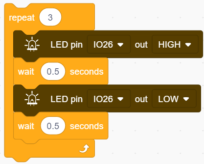
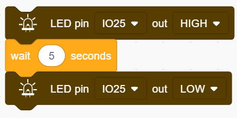
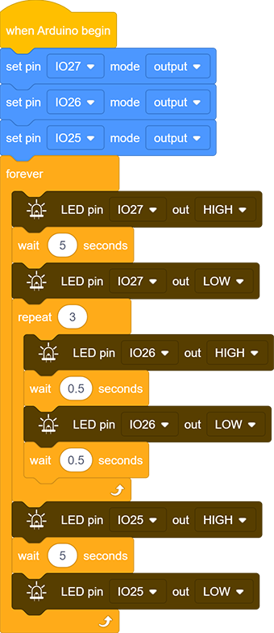

# **Project 4: Traffic Light**

### **1. Description**

The traffic light module is a device used to control the route of pedestrians and vehicles. It includes a red, a yellow and a green light, which implies different instructions.

**Red for Stop:** Pedestrians and vehicles stop proceeding.
**Yellow for Caution:** Pedestrians and vehicles are ready for stopping. If the drive is already in process, the speed should be slow. 
**Green for Proceed:** Pedestrians and vehicles keep going with the abidance of traffic regulations. 

In this project, you can use Arduino to write code to control traffic lights. For instance, set the duration of each lights and the interval time among them. Besides, you may also add a timer to alter light colors to schedule. 

### **2. Wiring Diagram**

### **3. Test Code**

We simply stimulate the traffic lights: green LED lights up for 5s, yellow LED blinks for 3 times, and red LED lights up for 5s. And we set this to loop. 

The blinking of yellow LED can utilize for()statement we have mentioned in project 3. Thus, we only need to set the lighting time to complete a traffic light. 

1. Drag the two code blocks.

2. Set the pin mode to “output”

3. Drag the following blocks from "LED" part and set the IO27 pin to HIGH and then LOW. Then set the delay time to 5s.    

4. Drag the following blocks from "Control" part and set the repeat time to 3, then set the IO26 pin to HIGH and then LOW. Then set the delay time to 0.5s.   

5. Repeat step 3, and set the pin to IO25.

**Complete Code：**

### **4. Test Result**

After uploading the code, green LED will light up for 5s, yellow LED will blink for 3 times, and red LED will be on for 5s.
