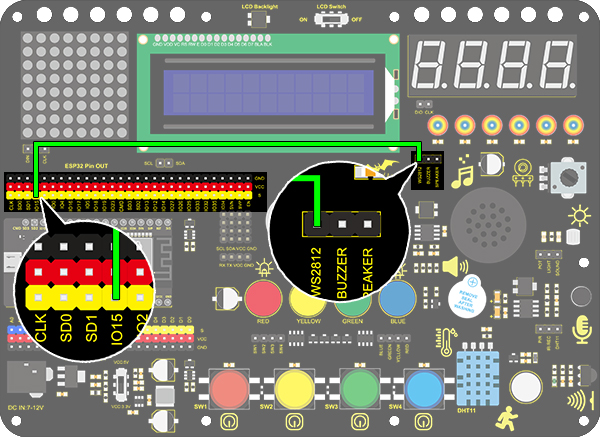
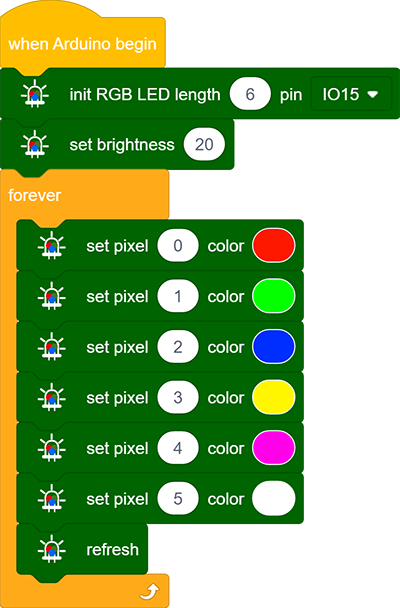
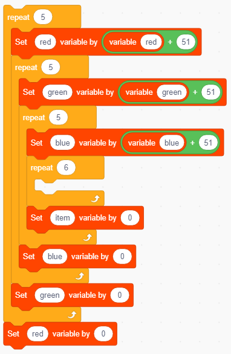
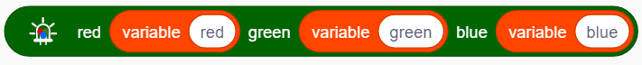
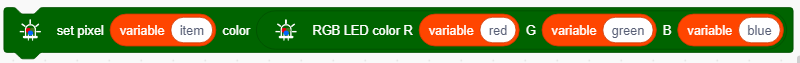
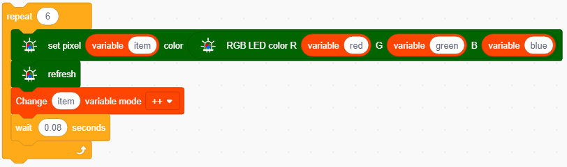
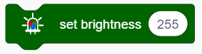
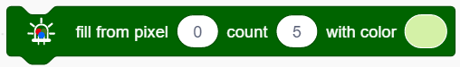

# **Project 5：Rainbow Ambient Light**

### **1. Description**

2812RGB LED is a programable colorful dreamy light, whose color, brightness and rhythm are adjustable.  This rainbow ambient light can be used as a dynamic decoration at will. Or you may control it to "dance with music". Importantly, it can be improved as an alarm. Its built-in sensor detects the ambient surroundings to warn users by changing  its color, brightness and rhythm.

### **2. Working Principle**

The data protocol adopts communication mode of single-line return-to-zero code. After the pixel is reset on power, DIN terminal receives data from the controller. The firstly arriving 24bit data will be extracted by the first pixel and be sent to the inner data register. 

Remaining data will be amplified by an amplification circuit and be transmitted through DOUT port to the next cascaded pixel. 
Being transmitted through pixels, the signal decreases 24bit each time. 

Besides, The pixel adopts automatic shaping and forwarding technology, insomuch that the cascade number of the pixel is only limited by the signal transmission speed.

### **3. Wiring Diagram**

### **4. Test Code**

Let's learn how to light up 2812 RGB and set its colors. 

1. Drag the two code blocks.

   

2. Drag the following block from "RGB LED" part and set the pin to IO15 and the number of LED to 6.

3. Drag the following block from "RGB LED" part and set brightness to 20. 

4. Drag the following blocks and set the number of LED to 0 ,1, 2, 3, 4 and 5, then choose red, green, blue, yellow, purple and  white colors. 

5. Add the following block.

**Complete Code：**

### **5. Test Result**

After uploading code, connecting the wiring and powering on, the LED will light up in different colors, as show below:

### **6. Knowledge Expansion**

In this expansion project, let's make a mini light show!

Nest four "repeat" blocks and add a "variable +" in them, then clear the corresponding variables to 0 at the end of each loop. 

Put the above three variables in "RGB" block so that these color values are controlled. Then add a refresh module.

Put the RGB in a "show color" block to display colors. And define a variable item to control the displayed LED.

The forever module is used to control RGB LEDs, which will cycle from 0-5 to gradually light up each light.

**Complete Code**

### **7. Code Explanation**

1. Set the number of 2812 RGB. A development board pin can control multiple 2812 RGB LEDs, so we need to set the number in advance and select the connected pin. 

2. Set the brightness of 2812 RGB. Input the brightness value within 0-255, in which 255 is the brightest.

3. This block will turn off all 2812 RGBs. 

4. Control the display of 2812 RGBs. We can fill the blanks to control the lighting LED and its color after selecting the pin. For instance, "0 to 0" means only the first LED lights up. After uploading the code, the first LED will turn on in the set color.

   **NOTE:** The two blanks also can be filled with variables, so that a light show is able to be formed. 

5. Set the color of 2812 RGBs. The displayed color can be modulated by the value in red, green and blue. We can add this block in the color settings of 2812 RGB.

   

6. It can control a single 2812 RGB display via enter the control led number and select the color.

7. The 2812 RGB will display the set color only after refreshing

