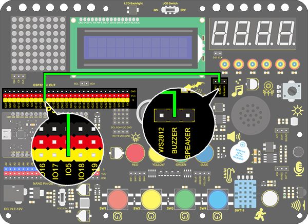
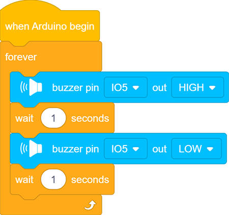

# **Project 7：Active Buzzer**
### **1. Description**
An active buzzer is a component used as an alarm, a reminder or an entertaining device, which boasts a reliable sound.
What's more, it empowers to stimulate highly controllable sounds, making our projects more interesting.

### **2. Working Principle**

An active buzzer integrates a multi-vibrator, so it makes sound only via DC voltage. Pin 1 of the buzzer connects to VCC and pin 2 is controlled by a triode. When a high level is provided for the base (pin 1) of the triode, its collector (pin 3) and emitter (pin 2) link to GND, and then the buzzer emits sound. 
Oppositely, if we offer a low level to the base, the rest of pins will be disconnected, so the buzzer will remain quiet.

### **3. Wiring diagram**

### **4. Test Code**

If the development board outputs a high level, the buzzer will emit sound. If it outputs a low level, the buzzer will stop ringing.

1. Drag the two basic code blocks.

   

2. Drag the following blocks from "Buzzer" part and set the IO5 pin to HIGH. Then set the delay time to 1s. 

3. Drag the following blocks from "Buzzer" part and set the IO5 pin to LOW. Then set the delay time to 1s. 

**Complete Code：**

### **5. Test Result**

After uploading code and powering on, the buzzer emits sound for 1s and stays quiet for 1s.

### **6. Code Explanation**

Buzzer output block. We firstly define the pin to IO5 and then set the output to "HIGH" or "LOW". The buzzer will beep when at HIGH, while it will be quiet at LOW.

