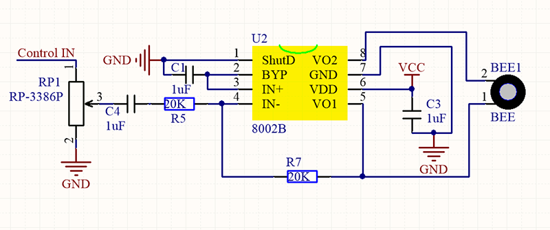
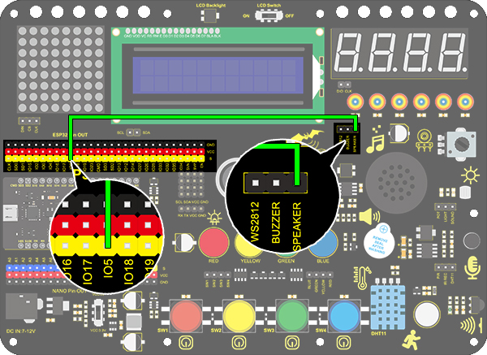
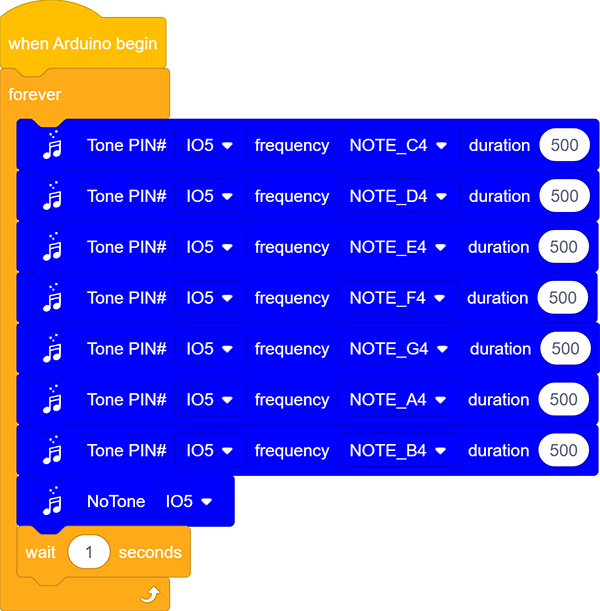
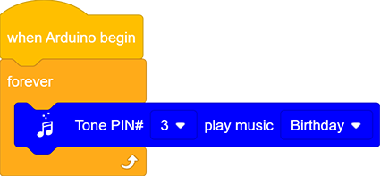
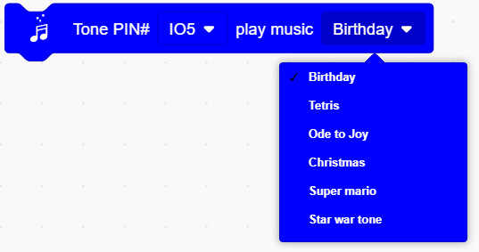

# **Project 8：Music Performer**

### **1. Description**

In this project, we will use a power amplifier speaker to play music. This speaker can not only play simple songs, but also perform what you desire. Thus, you can program other interesting codes in the project to accomplish splendid learning outcomes.

### **2. Working Principle**

The electrical signal is input from pin 1 of RP1 (adjusts signal intensity, which is also the sound volume).
After coupling in C4 and passing R5, the signal reaches IN- pin of 8002B, in which it is operationally amplified and output to BEE1 speaker. 

### **3. Wiring Diagram**

### **4. Test Code**

### **5. Test Result**

After uploading code and powering on, the amplifier circularly plays music tones with corresponding frequency: DO, Re, Mi, Fa, So, La, Si.

### **6. Knowledge Expansion**

Let's make it play a birthday song. We have already added some songs in library so you can directly drag these song blocks from "Music". 

**Code:**

### **7. Code Explanation**

1. Set the tone frequency. After setting the pin, we can select the frequency to compose music.  

2. Music module, for the convenience of use, we have integrated 6 pieces of music in the code, thus, we just need to set the pin and select the music.

3. Stop playing module, we only need to set the corresponding pin to stop the music

