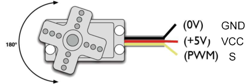
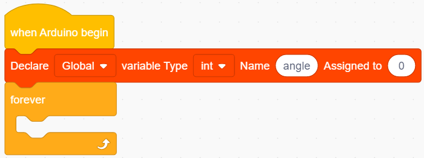
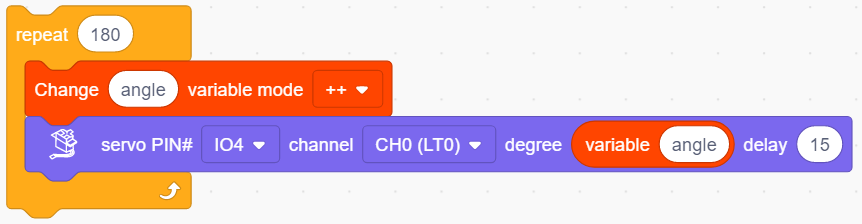
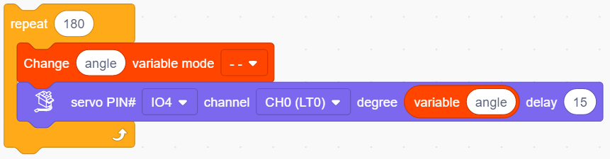
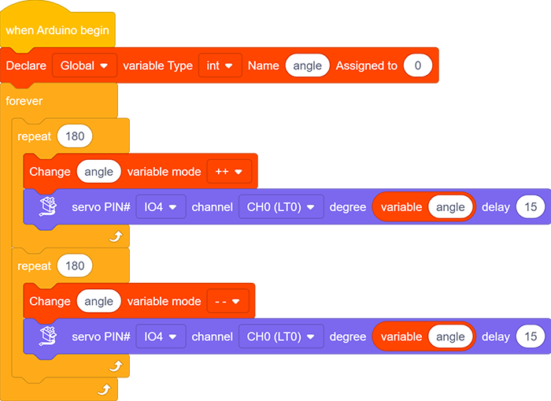

# **Project 12: Servo**

### **1. Description**
This servo features high performance and high precision with a maximum rotation angle of 180°. Weighting only 9g, it is perfectly suitable for any mini device in multiple occasions. What's more, it enjoys short startup time, low noise and strong stability.

### **2.  Working Principle**

**Angle range:** 180° (360°, 180° and 90°)

**Drive voltage:** 3.3V or 5V

**Pin:** Three wires

**GND:** Grounded(brown)

**VCC:** A red pin that connects to a +5v (3.3V) power

**S:** A orange signal pin that controlled via PWM signal

(1.png)

**Control Principle**: The rotation angle is controlled via duty cycle of PWM. Theoretically, standard PWM cycle is 20ms(50Hz), so pulse width should distribute within 1ms~2ms. However, the actual pulse width reaches 0.5ms~2.5ms, which corresponds to 0°～180°. Pay attention that, for the same signal, the rotation angle may vary from servo brands. 

### **3. Wiring Diagram**

### **4. Test Code**

1.Drag the two basic blocks and put a "variable" block between them. Set the variable type to int, name to angle, and assign 0 as its initial value. 

2. **Servo gradually rotates from 0° to 180°:** 

Add a repeat block and set the repeat times to 180(180 angles). Drag a "change variable" and a "servo" block and put them in the repeat one. Name the variable "angle" and select the mode "++". Set Servo PIN to IO4 and degree to the named variable. Don't forget to delay 15s.

3. **Servo gradually rotates from 180° to 0°:** Repeat step 2, but set the variable mode to "- -".

**Complete Code：**

### **5.  Test Result**

After connecting the wiring and uploading code, the servo starts to rotate from 0° to 180° and then from 180° to 0°.

### **6. Code Explanation**

1. Set the values of Servo. Servo pin and rotation angle can be controlled by setting parameters on this block.
   

2. Read the current degree of the Servo. 
   

   

