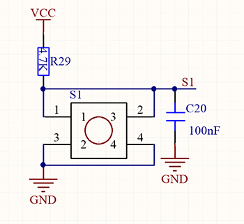
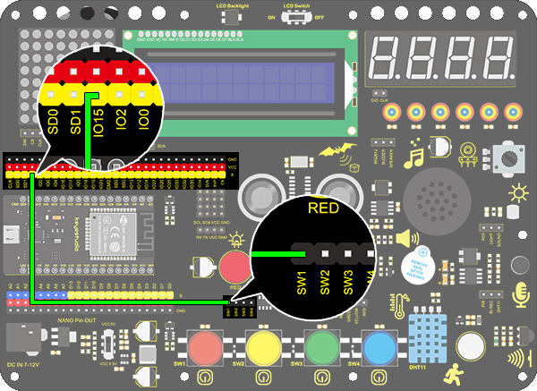
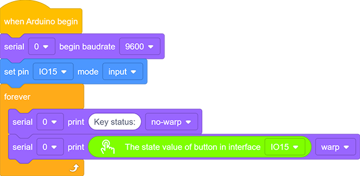
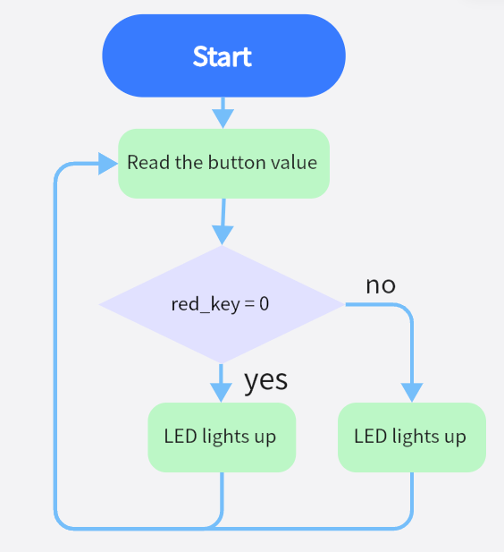
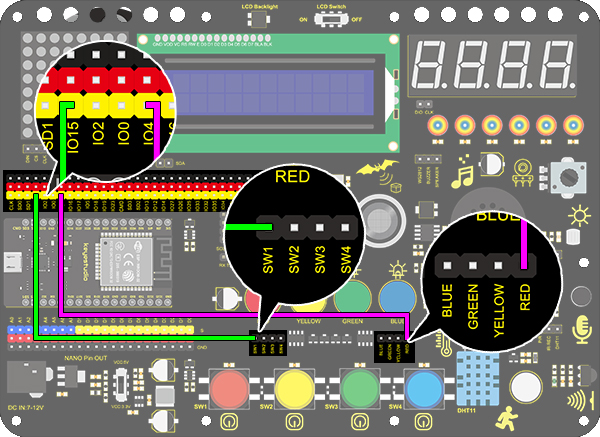
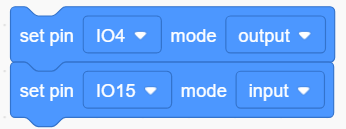
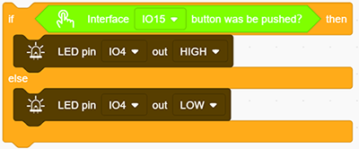
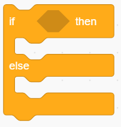

# **Project 13: Mini Lamp**

### **1. Description**

In this project, we are going to control a lamp via Arduino UNO and a button. When we press the button, the state of the lamp will shift(ON or OFF).

### **2. Working Principle**

When the button is released, a voltage VCC passing through R29 provides a high level for S terminal. 
When pressed, pin 1 and 3, pin 2 and 4 are connected and voltage on S1 arrives GND as a low level. At this moment, R29 avoids a short circuit between VCC and GND.

### **3. Wiring Diagram**

### **4.  Test Code**

1. Add two basic blocks.

2. Drag a "baud rate" from “Serial” and set it to 9600. 

3. Then drag a "print" block from “Serial”, type “Key status:” in the blank and set it to "no-warp".

4. Set the IO15 pim to “input”.

5. Drag another “Serial print” block  from “Serial” and set the mode to "warp". Add a "state value of button" from “Button” and set the pin to IO15.

**Complete Code:**

### **5. Test Result**

After connecting the wiring and uploading code, open the serial monitor and set the baud rate to 9600. 
When we press the button, serial port prints "Key status: 0"; When we release the button, serial port prints "Key status: 1".

### **6. Knowledge Expansion**

Next, we will control the LED through the state of buttons. 

**Flow Chart：**

**Wiring Diagram：**

**Code:**

1.Drag two basic blocks. 

2. Set the LED pin to “output”，and the button pin to “input”.

3. Drag a "if else" block from “Control”. Add a "button pin" block from “Button” after "if" and set its pin to IO15. Put an "LED output" block under "if" and set the output to HIGH, and put another under "else" and set to LOW. LED pins are both at IO4.

**Complete Code:**

### **8. Code Explanation**

**Note: Pin mode must be set to "input" when using the button module.**

1. Judge whether the button is pressed. If so, this block expresses true.

2. Read the button value. When the button is not pressed, the value is 1. Or else, it is 0.

3. If the condition in the hexagon is true, "if" block will be executed. Otherwise, the program runs "else" according to block.

4. Set the baud rate. Please guarantee the serial baud rate fit the counterpart of serial monitor, or it won't print anything. The commonly used baud rate are 9600 and 115200, and here we set to 9600.

5. Print characters on serial monitor. The printed words are what you type in the blank. Besides, three print modes are included: warp, no-warp and HEX (hexadecimal). 

