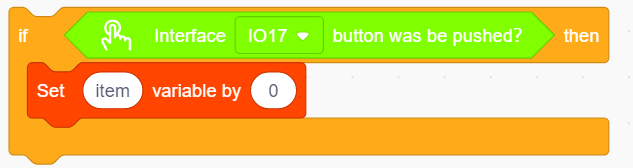
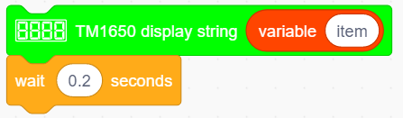

# **Project 14: Counter**

### **1. Description**
Arduino 4-bit digital tube counter can record numbers within 0~9999. It features display speed, count mode adjustment as well as reset function. This module is wildly applied in real-time counter (such as button-press and DC motor rotation count), gaming and experiment equipment.

### **2. Flow Chart**

### **3. Wiring Diagram**

### **4. Test Code**

1. Drag the two basic blocks.

2. Set the button pin to “input”.

3. put a "variable" block. Set the variable type to int and name to item. Assign 0 as its initial value. 

4. Drag an "if" block from “Control” (it executes only when its condition is satisfied). Put a “Button pressed” block from “Button” to the condition box(the hexagon one) and set the pin to IO19. Drag a "variable mode" block and put it after "then", and define it as "item" and set the mode to "++".

   

5. Repeat step 4, but set the interface to IO18 and mode to "– –".

6. Drag another "if" block from “Control” and define its condition that "interface IO17 button was be pushed?". Put a variable setting block after "then" and set the "variable by 0".

7. Drag a "if" block from “Control”. Find the "＞" block in “Operators” and fill the left blank with "variable item" and the right with "9999". Also, put a variable setting block after "then" and set the "variable by 0".

8. Drag a "TM1650 display" block from "Digital tube" and set the displayed string to "variable item" block. Finally, don't forget to add a 0.2s delay. 

**Complete Code:**

### **5. Test Result**

After connecting the wiring and uploading code, press green button to add 1, yellow to minus 1, and red to reset. 

### **6. Code Explanation**

**">"** block is used for judgment between two values. These two blanks can be replaced with either numbers or variables. 

