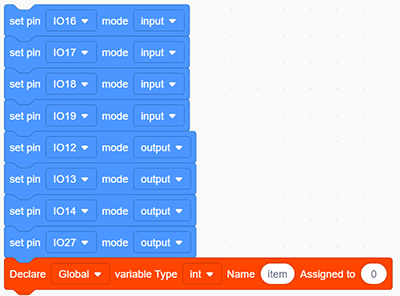
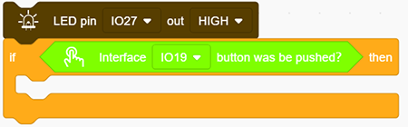
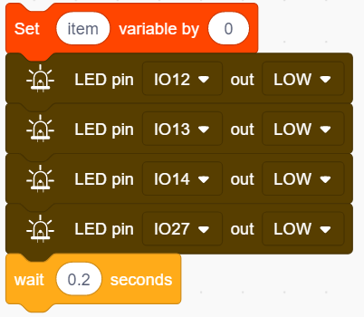
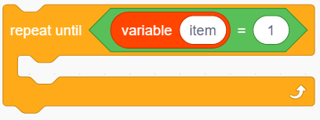
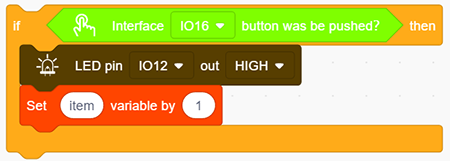
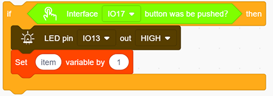

# **Project 15: Responder**

### **1. Description**
This programmable responder inputs and receives signals through Arduino development board and a group of buttons, and it judges the correctness of answers via a LED. It is a good object to exercise students' reaction ability and draw their attention to questions. If the answer is correct, the respondent obtains a lot scores. 

Moreover, it simplifies teachers' manipulation of question-grabbers and cuts answer clutters. It may even stimulate students' interests in learning. 

### **2. Flow Chart**

### **3. Wiring Diagram**

### **4. Test Code**

1. Drag the two basic blocks and put a "variable" block between them. Set the variable type to int and name to item with an initial assignment of 0. Set the LED pin to “output”, and the button pin to “input”.

2. Add an "LED output" block, define its pin to IO27 and set the output to HIGH. 

3. .Drag an "if" block and add the condition "interface IO19  button was be pushed?".

4. Add a variable setting and four LED output blocks under "then". Among them, we name the variable "item" with an assignment of "0", and set all outputs to LOW respectively at pin 12,13,14 and 27 (The responder works only when all LED light off). Likewise, don't forget a 0.2s delay. 

5. Add a "repeat until" block and set the "until" to "item = 1", as shown below. When item = 1, exit the loop. 

6. Drag another "if" block and set the condition "Interface IO16 button was be pushed?". Add an "LED output" block under "then" and set the output to HIGH at pin IO12. And add a "set item variable by 1" to exit this condition block. 

7. Repeat step 6, but set interface to IO17 and LED pin to IO13. 

8. Operate step 6 again, but set interface to IO18 and LED pin to IO14. 

**Complete Code:**

### **5. Test Result**

Connect the wiring and upload the code. The answers of respondents are only valid when the red LED is off(red button is pressed). 

When someone presses his/her button(yellow, green or blue), the appropriate LED as well as the red counterpart light up. By now, rest of LED cannot turn on when pressing buttons. The responding action can be performed only when the red button is pressed again. 

### **6. Code Explanation**

1. Condition loop module. When the conditions in the diamond box of the module are met, the loop will exit .

2. "=" block is used to judge whether the two values are equal.

