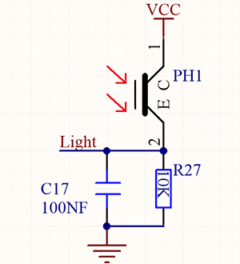
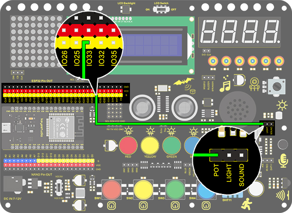
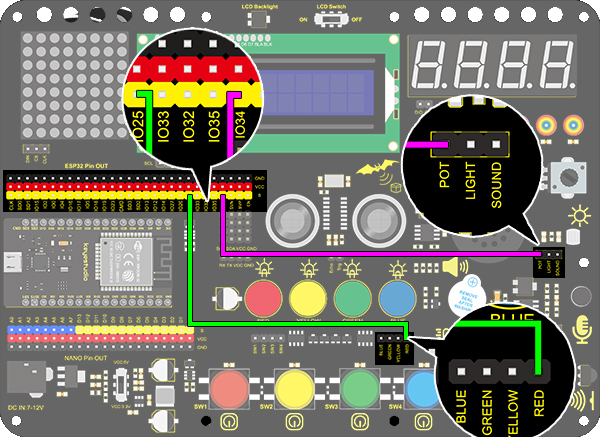

# **Project 19 : Dimming Lamp**

### **1. Description**
The dimming lamp adjusts the brightness of LED via a potentiometer and an Arduino controller. The brightness is subject to resistance value, which can be read and adjusted by connecting the ends of the potentiometer to digital or analog pins on board. 
What's more, this system is applied to control voltage or current of other devices such as fans, bulbs and heaters. 

### **2. Working Principle**

Essentially, potentiometer is an element that can change the value of resistance. According to Ohm's law(U=I*R), the resistance affects the voltage. Our potentiometer is 10K.

In this project, the maximum resistance is 10K. The ESP32 board will equally divide the voltage of 3V into 4095 parts (3/4095=0.0007326007326. The analog voltage is obtained by multiplying the read value and 0.0007326007326. 

### **3. Wiring Diagram**

### **4. Test Code**

The analog value of the potentiometer can be read:

1. Drag the two basic blocks. Put the baud rate setting block between them and set to 9600.

2. Add a "serial print" block in "forever" loop, and select "warp" as the print mode.

3. Drag a "read the value" from “pot” to the serial print, and set the pin to IO33. 

### **5. Test Result**

After connecting the wiring and uploading code, open serial monitor to set baud rate to 9600, and the analog value will be displayed within the range of 0-4095.

### **6. Expansion Code**

We will control the brightness of LED via a potentiometer. 
As we know, it is influenced by PWM. However, the range of analog value is 0-4095 while that of PWM is 0-255. Thus, a "map(value, fromLow, fromHigh, toLow, toHigh)" function is needed.

**Wiring Diagram：**

1. Drag the two basic blocks.

2. Add a variable block and set it to local. Select "int" as its type and name it as "pot". 

3. Drag a "map" function from “Data” and put it to the assignment position. Set the value of "map" to "read the value of pot IO33", whose range is from (0,4095) to (0,255.

4. Finally add an "LED analogWrite" block. Set the pin to IO25 and analog value to the variable "pot".

**Complete Code:**

### **7. Code Explanation**

1. **map** function. The analog value range can be converted from 0-4095 to 0-255. 
   
2. Read the analog value of potentiometer by setting its pin. 
   

