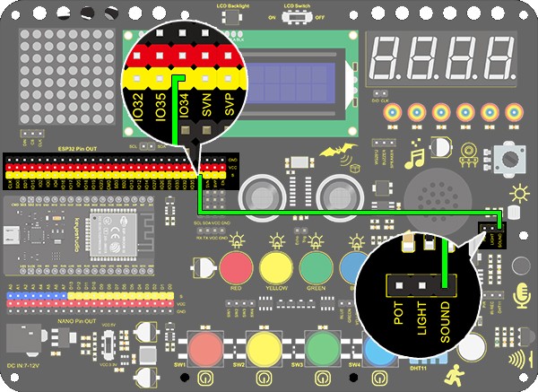
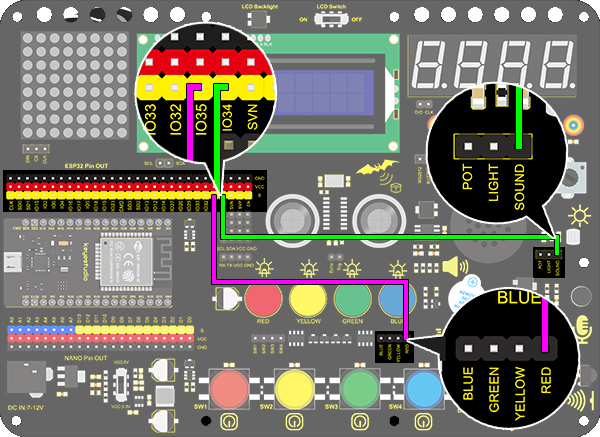
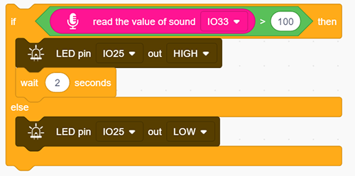
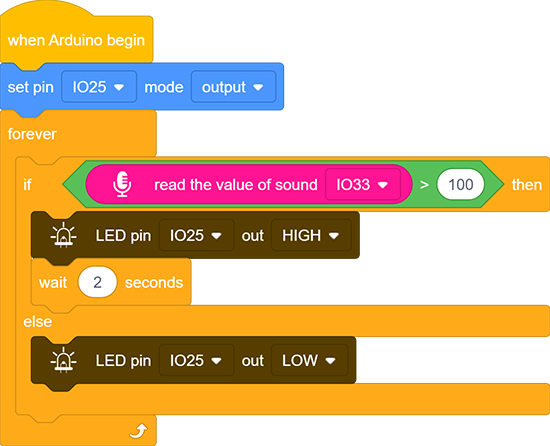

# **Project 21: Sound Controlled LED**

### **1. Description**
Sound controlled LED is a device used to detect sound in a way that controls the brightness of LED, which is composed of a Arduino board and some components. It can connect to multiple sensors such as microphones. It converts sound to changing voltage signal to be received by Arduino to control the LED on and off.

### **2. Working Principle**

When detecting a sound, the electret film in microphone vibrates, which changes the capacitance and generates a subtle change of voltage. 

Next, we make use of LM386 chip to build a proper circuit to amplify the detected sound up to 200 times, which can be adjusted by a potentiometer. Rotate it clockwise to enlarge the times. 

### **3. Wiring Diagram**

### **4. Test Code**

Find the "read the value" block in “Sound”, and print the read sound in the serial port. Construct blocks as follows. Pay attention that do not add a delay when using the sound sensor.

### **5. Test Result**

After connecting the wiring and uploading code, open serial monitor to set baud rate to 9600, the analog value will be displayed.

### **6. Expansion Code**

The commonly seen corridor light is a kind of sound controlled light. Meanwhile, it also includes a photoresistor. 

Differed from that, here we establish a model that an LED is only affected by sound. When the analog volume exceeds 100, LED lights up for 2s and then goes off.

**Flow Chart：**

**Wiring Diagram：**

**Code：**

1. Drag two basic blocks.

2. Drag an "if else" block, and fill the hexagon with a item＞100 block. Set the value to "read the value of sound IO33". If the condition is satisfied, LED outputs a HIGH level at pin IO25 with a delay of 2s; or else, it outputs a LOW level at the same pin without a delay. 

**Complete Code:**

### **7. Code Explanation**

Read the value of sound by setting the related pin.

