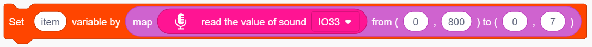
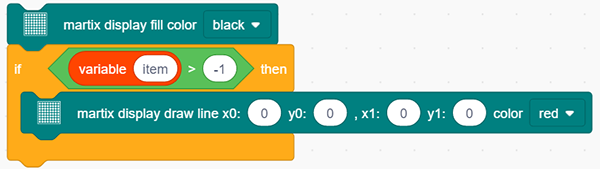
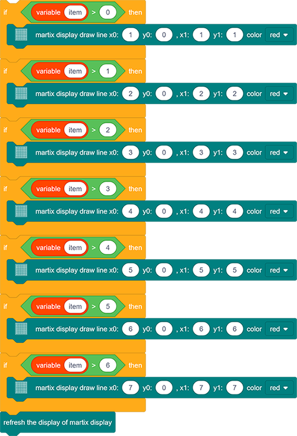
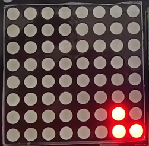

# **Project 22: Noise Meter**

### **1.  Description**

Arduino noise meter embodies the sound signal to a series of dots, which are converted into patterns displayed on dot matrix. 

### **2. Wiring Diagram**

### **3. Test Code**

1. Drag the basic blocks and initialize the display. Set the pin CS to IO15 and brightness to 3. Then add a variable block and select int and name it as "item" with an initial assignment of 0.

2. Add a variable block and name it as "item". Adopt a map function to convert the read sound value range from 0-4095 to 0-7, yet the hypothesis maximum value of sound is 800.

3. Clear the display. 
4. Program a condition. If the variable item is greater than -1, the dot matrix displays (x0:0  y0:0 x1:1  y1:0) in color of red.

5. Repeat step 4, but the judgment is whether item is greater than 0. If so, dots at (x0:1  y0:0  x1:1  y1:1) will light up. By that analogy, build code blocks referring to the following coordinates. 

6. Finally, refresh the display. 

**Reference Coordinates:**

**Complete Code:**

### **4. Test Result**

After connecting the wiring and uploading code, the noise level view is displayed on dot matrix, as shown below.

            
