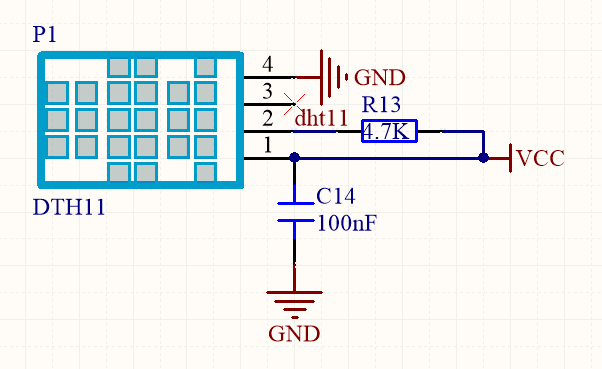
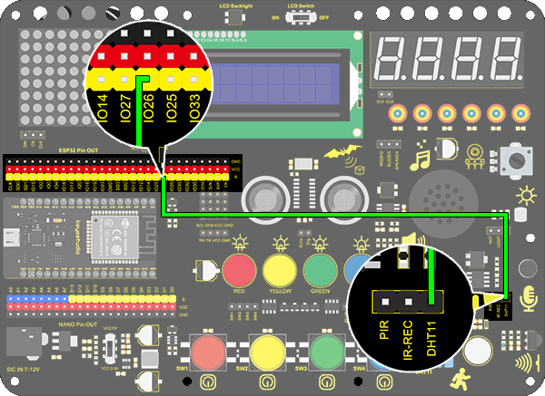
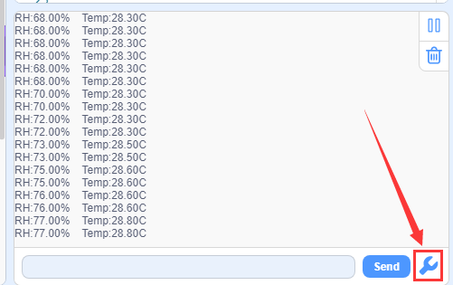
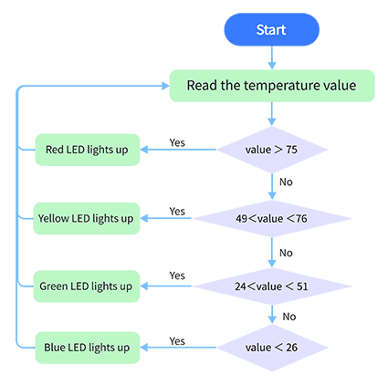
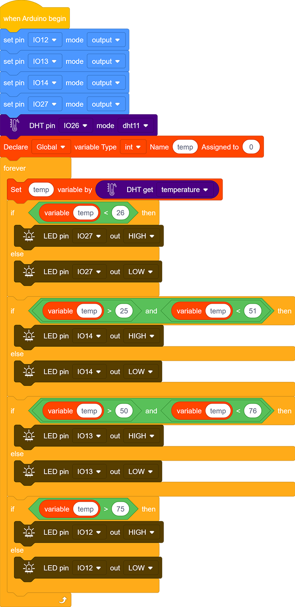

# **Project 23: Smart Cup**

### **1. Description**
In this project, we mainly adopt the Arduino development board to create a programmable smart cup, which reveals the temperature of inner liquid through a RGB indicator. It can control the brightness of the light by setting a temperature threshold. If the threshold is exceeded, it will get brighter. Otherwise, it gets darker. 

The smart cup enables to help users better control the temperature of their drinking water and effectively prevent overheating or freezing.

### **2. Working Principle**

Related settings in DHT11 is provided by manufacturers, so you only need to orderly read and process data according to its sequence chart. 

Besides, the relevant codes are packaged in our libraries, which is convenient for you to set pins and read values. 

### **3. Wiring Diagram**

### **4. Test Code**

1. Drag two basic blocks. Add the serial baud rate module and set the baud rate to 9600.

2. Drag the DHT module from “Temperature and humidity” and set the pin to IO26, mode to dht11.

3. Add serial print module with no-wrap, and set the print to “RH:”, then follow the steps below, and add a delay of 1s.

**Complete Code:**

### **5. Test Result**

After connecting the wiring and uploading code, click  to open serial monitor to set baud rate to 9600, and the temperature and humidity value will be displayed.

### **6. Expansion Code**

In this expansion experiment, we will make a smart cup which can show liquid temperature. We divide 100 into four parts with an LED representing for each: 

**Red LED: ** 100-75°C
**Yellow LED: ** 75-50°C
**Green LED: ** 50-25°C
**Blue LED:**  25-0°C

**Flow Chart：**

**Wiring Diagram：**

**Code：**

1. Drag two basic blocks. Then set the 4 LED pins to “output” , the DHT11 pin to IO26, mode to dht11 and the variable name to temp.

2. Assign the temperature value of DHT11 to the variable temp

3. Use the "if else" to judge the variable temp. If the conditions are met, the corresponding LED will be on, otherwise it will be off. 

   

**Complete Code:**

### **7. Code Explanation**

1. In this code block, the marked number can be filled in the blank so that multiple temperature and humidity sensors can be connected. After setting the pin and mode, the value can be read. In this project, we set the mode to DHT11.
   
2. Read the temperature and humidity code block.
   

