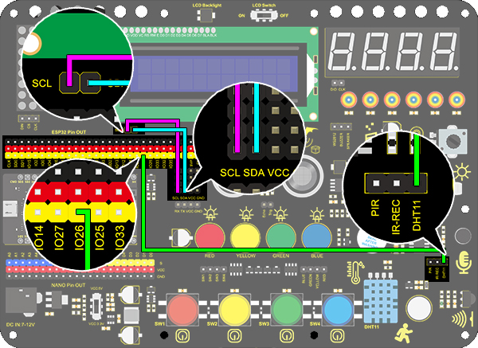
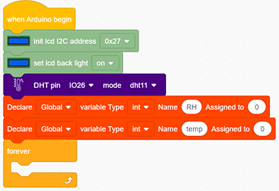
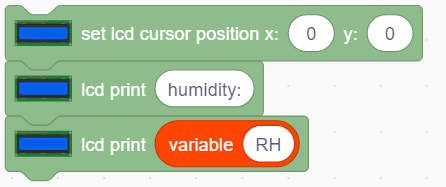

# **Project 24: Weather Station**

### **1. Description**

This weather station records the ambient temperature and humidity value via Arduino board and a temperature and humidity sensor. 

Moreover, it empowers to adjust temperature and humidity values according to environmental parameters as a way to achieve comfortable environmental conditions.

### **2. Wiring Diagram**

### **3. Test Code**

1. Add two basic modules. Initialize the LCD 1602 and turn ON the backlight of the LCD 1602 (remember to switch the LCD to ON). Set the pin of dht to IO26 and mode to dht11. Set two int variables to “RH“ and “temp“ to 0.

2. Assign humidity value to the variable RH, and the temperature value to the variable temp.

3. Set the LCD display position to x: 0 and y: 0. Add the lcd display module and set the display character to "humidity:". Add the lcd display module again and add the variable RH to the white box.

 

4. Repeat the step 3, but set y : 1 and the display character to “temperature:” and add the variable temp to the white box.

**Complete Code:**

### **4. Test Result**

After connecting the wiring and uploading code, LCD display will directly discover the ambient humidity and temperature value.

