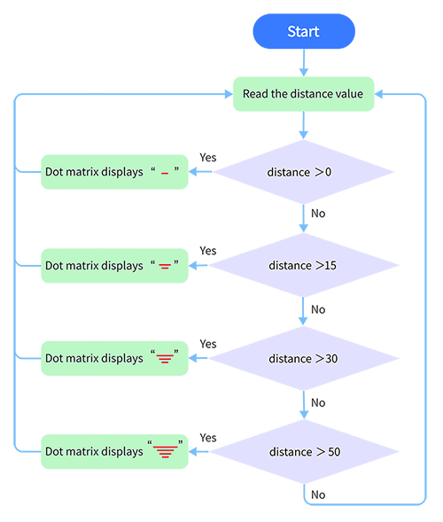

# **Project 27: Intelligent Parking**

### **1. Description**
This intelligent parking system detects and optimizes parking position via an ultrasonic sensor. With this system, wrong parking is avoided to a large extent. 

Firstly, you need to install the sensor around the carpark. And then it will detect the distance between the car and its edges and send the information to the development board so as to control the car to automatically adjust to the optimal parking position.

### **2.  Flow Chart**

### **3. Wiring Diagram**

### **4. Test Code**

Assign the detected distance value to a variable, and judge whether it is greater than the set threshold value. If so, corresponding lines on the dot matrix light up. In this way, a distance can be revealed by lighting lines. 

**Reference Coordinates:**

**Complete Code:**

### **5. Test Result**

After connecting the wiring and uploading code, lines will be displayed on the dot matrix. If the detected distance is less than 50cm, there will be fewer lines.

