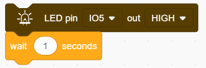
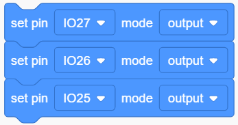
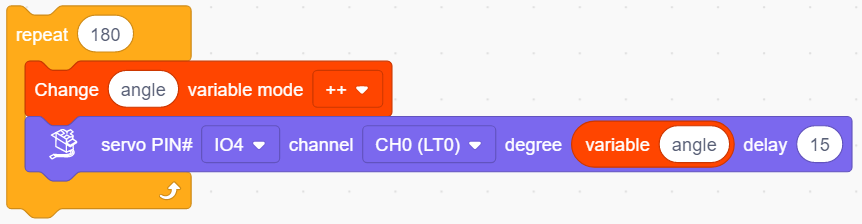
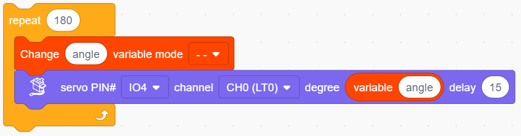
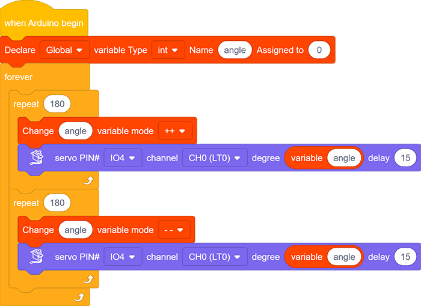
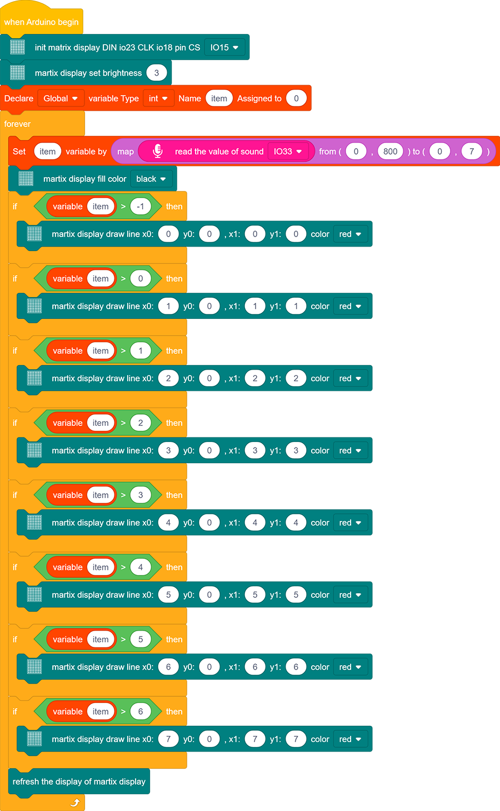
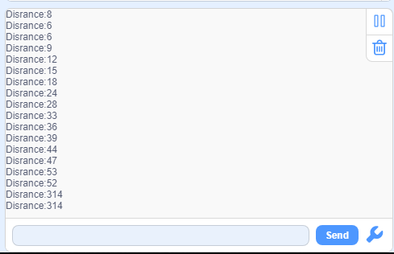
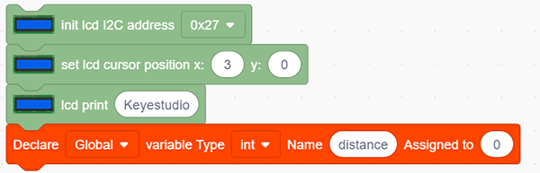
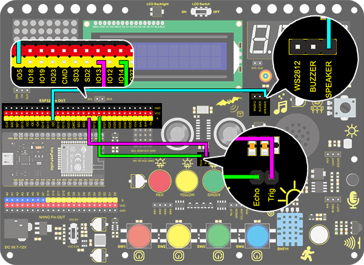
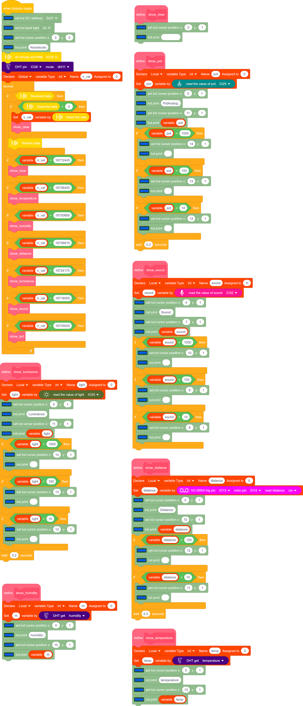

# Project

## **Project 1: LED Blinking**

###  **1. Description**

LED blinking is a simple project designed for starters. You only need to install an LED on Arduino board and upload the code on Arduino IDE. This project reinforces the learning of Arduino conceptual framework and using methods for starters. 

###  **2. Working Principle**

**LED:** Generally speaking, limited IO ports of output current may cause low brightness of LED, so a NPN triode (Q2) is applied in circuit as a switch. In this case, the LED will light up if the base(pin 1) of triode is at a high level. On the contrary, LED goes off when the base is at low. 

**Triode switch:** Briefly, LED lights up when the base(pin 1) is at a high level. In the same breath, the collector(pin 3) and emitter(pin 2) are connected, and then VCC passes through a current-limiting resistor to LED and finally to GND, which forms a circuit. On the contrary, LED goes off when the base is at low. In this circumstance, the collector and emitter are disconnected  and the LED lights off.

### **3. Wiring Diagram**

###  **4. Test Code**

According to previous principles, we can control LED via levels of pins on the development board.

1. Drag  the following block in "Events" part. 

2. Drag the following block  in "Control" part . 

3. Drag the following block  in "Pins" part and set the IO5 pin to output.

4. Drag the following block  in "LED" part and set the IO5 pin to HIGH.

5. Drag the following block  in "Control" part . 

6. Drag the following blocks and set the IO5 pin to LOW. 

**Complete Code：**

###  **5. Test Result**

After uploading the code and powering on, LED will be on for 1s and off for 1s.

### **6. Code Explanation**

**Note: Pin mode must be set to "output" ** **when using LED module**

1.Code blocks will not execute if the following block is not exist.

	2. Code blocks in  the following block will execute in a loop. 

2.It is a module used to set the pin mode(control LED and buzzer for “output” mode, and read sensor module for “input” ).

3.It is a module used to set the pin and the levels("HIGH" and "LOW").

4.It is a module used to set the delay time.

## **Project 2: Breathing LED**

### **1. Description**

Arduino breathing led utilizes on-board programmable PWM to output analog waveform. After powering on, LED brightness can be adjusted through duty cycle of the waveform to eventually realize the effect of breathing led. 
In this way, ambient light can be simulated by changing LED brightness over time. Also, breathing led can form a colorful mini light to construct a tranquil and warm environment.

### **2. What is PWM?**

PWM controls analog output via digital means, which is able to adjust duty cycle of the wave (a signal circularly shifting between high level and low level).

For Arduino, digital ports of voltage output are LOW and HIGH, which respectively correspond to 0V and 5V. Generally, we define LOW as 0 and HIGH as 1. Arduino will output 500 signals of 0 or 1 within 1s. If they are "1", 5V will be output. Oppositely, if they are all 0, the output will be 0V. Or if they are 010101010101..., the average output will be 2.5V. 

In other words, output ratio of 0 and 1 affects the voltage value, the more 0 and 1 signals are output per unit time, the more accurate the control will be. 

### **3. Wiring Diagram**

### **4. Test Code**

We adopt "for" statement to increase a variable from 0 to 255, and define the variable as PWM output (analogWrite(pin, value)). By the way, a delay time may reinforce the control of LED shining time. Next, we use another "for" statement to decrease it from 255 to 0 with a delay time to control LED dimming process. 

1. Drag the two code blocks.

2. Drag the following block from "Variables" part, and define the name to "item" with an initial assignment "0". Put this block in "forever" block. 

3. Drag  the following block from "Control" part and set it to 255 times, which is the maximum value of PWM.

4. Drag the following block from "Variables" part, put "item" as its changed object and set the mode to "++".

5. Drag the following block from “LED” part and set the LED pin to IO5. Then add an "variable" block in it and fill in the blank with "item". 

6. Drag the following block from "Control" part and set the time to 0.01s , that is 10ms. 

7. According to previous steps, build another code block with the only difference of variable mode "– –".

**Complete Code：**

### **5. Test Result**
After uploading the code, we can see the LED dims gradually. It "breathes" evenly.
### **6. Code Explanation**

1. This block is used to set variable usable range, variable type , name and its initial value.
   
2. Repeating times can be assigned in the blank of this repeat block. 
   
3. Input a variable name in the blank and its value will add 1 each time the code executes. "++" can be altered to "– –".
   
4. Input a variable name in the blank and its value will reduce 1 each time the code executes.  "– –" can be altered to "++" . 
   
5. This is a PWM output module, and the white box is the value of the output PWM.
   

## **Project 3：SOS Distress Device**

### **1. Description**

SOS device is able to emit distress signals, which coincides with the principle of Morse code. It is convenient for emergencies.

### **2. Wiring Diagram**

### **3. Test Code**

What we should clear firstly is how SOS distress light blinks: LED quickly blinks 3 times for “S” and slowly blinks 3times for “O”. 
And then, we control the blinking times and duration via "for" statement and set interval time among letters. 

1. Drag the two code blocks.

2. Drag the following block  in "Pins" part and set the IO5 pin to output.

**Letter "S"**

3. Drag the following block from "Control" part and set to 3 times, as "S" means blink for 3 times. 

4. Drag the following blocks from "LED" part and set the IO5 pin to HIGH. Then set the delay time to 0.15s. 

5. Drag the following blocks from "LED" part and set the IO5 pin to LOW. Then set the delay time to 0.1s.  

**Letter O**

6. Refer to previous steps to build the following code blocks. Modify the HIGH ouput to delay 0.4s and LOW to 0.2s.   

**Letter S**

7. Operate step 3 ,4 and 5 again. 

8. Add a delay time of 5s to the end, and "SOS" will repeat every 5s.   

**Complete Code：**

### **4.Test Result**

After uploading the code, LED respectively blinks for 3 times quickly and slowly.

## **Project 4: Traffic Light**

### **1. Description**

The traffic light module is a device used to control the route of pedestrians and vehicles. It includes a red, a yellow and a green light, which implies different instructions.

**Red for Stop:** Pedestrians and vehicles stop proceeding.
**Yellow for Caution:** Pedestrians and vehicles are ready for stopping. If the drive is already in process, the speed should be slow. 
**Green for Proceed:** Pedestrians and vehicles keep going with the abidance of traffic regulations. 

In this project, you can use Arduino to write code to control traffic lights. For instance, set the duration of each lights and the interval time among them. Besides, you may also add a timer to alter light colors to schedule. 

### **2. Wiring Diagram**

### **3. Test Code**

We simply stimulate the traffic lights: green LED lights up for 5s, yellow LED blinks for 3 times, and red LED lights up for 5s. And we set this to loop. 

The blinking of yellow LED can utilize for()statement we have mentioned in project 3. Thus, we only need to set the lighting time to complete a traffic light. 

1. Drag the two code blocks.

2. Set the pin mode to “output”

3. Drag the following blocks from "LED" part and set the IO27 pin to HIGH and then LOW. Then set the delay time to 5s.    

4. Drag the following blocks from "Control" part and set the repeat time to 3, then set the IO26 pin to HIGH and then LOW. Then set the delay time to 0.5s.   

5. Repeat step 3, and set the pin to IO25.

**Complete Code：**

### **4. Test Result**

After uploading the code, green LED will light up for 5s, yellow LED will blink for 3 times, and red LED will be on for 5s.
## **Project 5：Rainbow Ambient Light**

### **1. Description**

2812RGB LED is a programable colorful dreamy light, whose color, brightness and rhythm are adjustable.  This rainbow ambient light can be used as a dynamic decoration at will. Or you may control it to "dance with music". Importantly, it can be improved as an alarm. Its built-in sensor detects the ambient surroundings to warn users by changing  its color, brightness and rhythm.

### **2. Working Principle**

The data protocol adopts communication mode of single-line return-to-zero code. After the pixel is reset on power, DIN terminal receives data from the controller. The firstly arriving 24bit data will be extracted by the first pixel and be sent to the inner data register. 

Remaining data will be amplified by an amplification circuit and be transmitted through DOUT port to the next cascaded pixel. 
Being transmitted through pixels, the signal decreases 24bit each time. 

Besides, The pixel adopts automatic shaping and forwarding technology, insomuch that the cascade number of the pixel is only limited by the signal transmission speed.

### **3. Wiring Diagram**

### **4. Test Code**

Let's learn how to light up 2812 RGB and set its colors. 

1. Drag the two code blocks.

   

2. Drag the following block from "RGB LED" part and set the pin to IO15 and the number of LED to 6.

3. Drag the following block from "RGB LED" part and set brightness to 20. 

4. Drag the following blocks and set the number of LED to 0 ,1, 2, 3, 4 and 5, then choose red, green, blue, yellow, purple and  white colors. 

5. Add the following block.

**Complete Code：**

### **5. Test Result**

After uploading code, connecting the wiring and powering on, the LED will light up in different colors, as show below:

### **6. Knowledge Expansion**

In this expansion project, let's make a mini light show!

Nest four "repeat" blocks and add a "variable +" in them, then clear the corresponding variables to 0 at the end of each loop. 

Put the above three variables in "RGB" block so that these color values are controlled. Then add a refresh module.

Put the RGB in a "show color" block to display colors. And define a variable item to control the displayed LED.

The forever module is used to control RGB LEDs, which will cycle from 0-5 to gradually light up each light.

**Complete Code**

### **7. Code Explanation**

1. Set the number of 2812 RGB. A development board pin can control multiple 2812 RGB LEDs, so we need to set the number in advance and select the connected pin. 

2. Set the brightness of 2812 RGB. Input the brightness value within 0-255, in which 255 is the brightest.

3. This block will turn off all 2812 RGBs. 

4. Control the display of 2812 RGBs. We can fill the blanks to control the lighting LED and its color after selecting the pin. For instance, "0 to 0" means only the first LED lights up. After uploading the code, the first LED will turn on in the set color.

   **NOTE:** The two blanks also can be filled with variables, so that a light show is able to be formed. 

5. Set the color of 2812 RGBs. The displayed color can be modulated by the value in red, green and blue. We can add this block in the color settings of 2812 RGB.

   

6. It can control a single 2812 RGB display via enter the control led number and select the color.

7. The 2812 RGB will display the set color only after refreshing

## **Project 6：Water Flow Light**
### **1. Description**

This simple water flow light project enables to help you learn electronic packaging. In this project, we will control LEDs to change the color in a specified speed via a Arduino board.

### **2. Wiring Diagram**

### **3. Test Code**

A water flow light consists of a stream of LED lighting from left to right.

1. Drag the two basic code blocks.

   

2. Set the pin mode to “output”

2. Drag the following blocks from "LED" part and set the IO15 pin to LOW, the IO12 pin to HIGH. Then set the delay time to 0.2s.  

3. Drag the following blocks from "LED" part and set the IO12 pin to LOW, the IO13 pin to HIGH. Then set the delay time to 0.2s.  

4. Drag the following blocks from "LED" part and set the IO13 pin to LOW, the IO14 pin to HIGH. Then set the delay time to 0.2s. 

5. Drag the following blocks from "LED" part and set the IO14 pin to LOW, the IO15 pin to HIGH. Then set the delay time to 0.2s.  

**Complete Code：**

### **4. Test Result**

After uploading code and powering on, the LEDs light up from left to right.

## **Project 7：Active Buzzer**
### **1. Description**
An active buzzer is a component used as an alarm, a reminder or an entertaining device, which boasts a reliable sound.
What's more, it empowers to stimulate highly controllable sounds, making our projects more interesting.

### **2. Working Principle**

An active buzzer integrates a multi-vibrator, so it makes sound only via DC voltage. Pin 1 of the buzzer connects to VCC and pin 2 is controlled by a triode. When a high level is provided for the base (pin 1) of the triode, its collector (pin 3) and emitter (pin 2) link to GND, and then the buzzer emits sound. 
Oppositely, if we offer a low level to the base, the rest of pins will be disconnected, so the buzzer will remain quiet.

### **3. Wiring diagram**

### **4. Test Code**

If the development board outputs a high level, the buzzer will emit sound. If it outputs a low level, the buzzer will stop ringing.

1. Drag the two basic code blocks.

   

2. Drag the following blocks from "Buzzer" part and set the IO5 pin to HIGH. Then set the delay time to 1s. 

3. Drag the following blocks from "Buzzer" part and set the IO5 pin to LOW. Then set the delay time to 1s. 

**Complete Code：**

### **5. Test Result**

After uploading code and powering on, the buzzer emits sound for 1s and stays quiet for 1s.

### **6. Code Explanation**

Buzzer output block. We firstly define the pin to IO5 and then set the output to "HIGH" or "LOW". The buzzer will beep when at HIGH, while it will be quiet at LOW.

## **Project 8：Music Performer**

### **1. Description**

In this project, we will use a power amplifier speaker to play music. This speaker can not only play simple songs, but also perform what you desire. Thus, you can program other interesting codes in the project to accomplish splendid learning outcomes.

### **2. Working Principle**

The electrical signal is input from pin 1 of RP1 (adjusts signal intensity, which is also the sound volume).
After coupling in C4 and passing R5, the signal reaches IN- pin of 8002B, in which it is operationally amplified and output to BEE1 speaker. 

### **3. Wiring Diagram**

### **4. Test Code**

### **5. Test Result**

After uploading code and powering on, the amplifier circularly plays music tones with corresponding frequency: DO, Re, Mi, Fa, So, La, Si.

### **6. Knowledge Expansion**

Let's make it play a birthday song. We have already added some songs in library so you can directly drag these song blocks from "Music". 

**Code:**

### **7. Code Explanation**

1. Set the tone frequency. After setting the pin, we can select the frequency to compose music.  

2. Music module, for the convenience of use, we have integrated 6 pieces of music in the code, thus, we just need to set the pin and select the music.

3. Stop playing module, we only need to set the corresponding pin to stop the music

## **Project 9：Digital Tube Display**

### **1.  Description**
This 4-Digit tube display is a device used to display counting or time, which is able to  display numbers from 0 ~ 9 and simple letters. It consists of four digital tubes, each of which has seven light-emitting diodes (LED). 

Moreover, multiple functions can be realized by connecting their pins to the Arduino development board, such as timekeeping and some game storing. 

### **2. Working Principle**

TM1650 utilizes IIC protocol and adopts two bus lines (SDA and SCL).

The code is provided in our blocks, and the digital tube will display numbers via this code. 

### **3. Wiring Diagram**

### **4. Test Code**

To show numbers on the display, you only need to drag a "TM 1650 display" block from "Digital tube" and set the number string to 9999.

### **5. Test Result**

After connecting the wiring and uploading code, the digital tube display shows "9999", as shown below.

### **6. Extended Code**

Let's have some difficult operations. Rather than static numbers, we handle it to show some dynamic ones. 
The following code manipulates the tubes to display 1~9999.

1. Drag the two basic code blocks.

   

2. Drag the following block from "Variables". Set the type to int and name to item, and assign 0 as its initial value.

3. Drag the following block from "Control" and set to 9999 times.  

4. Drag a "variable mode" from "Variables", define its name to item and set the mode to "++".

5. Drag a "TM 1650 display" block from "Digital tube" and replace the string value with variable item. Add a delay time of 0.5s after it. 

6. Add a "set variable" block after the "repeat" block. Set item variable by 0. Otherwise, the item value will be out of display range after 9999 loops.

**Complete Code：** 

### **7.  Code Explanation**

1. Set the display string. Directly type numbers or letters you want to display in the blank

2. Set the ON or OFF of this TM 1650 digital tube. Each tube can be controlled separately. 

3. It is able to clear the display or used as a master switch to turn on or turn off the digital tube. 

## **Project 10：Dot Matrix Display**

### **1. Description**
This module consists of a 8x8 LED dot matrix with one control pin for each row as well as each column to adjust the brightness of LED. Connecting with Arduino board, the brightness of LED is controlled to display characters and figures via Arduino programming. In this way, simple characters, numbers and figures are able to be displayed. It also can be applied in game machines or screens.

MAX7219 is an IC with SPI communication and can be used to control the 8x8 dot matrix. The MAX7219 SPI communication has integrated in our libraries and you can recall directly.

### **3. Wiring Diagram**

### **4. Test Code**

1.Drag the two basic code blocks.

2.Drag a "init matrix display" from “Matrix” and set CS to IO15. DIN and CLK are fixed pin respectively to IO23 and IO18.

3. Drag a "set brightness" block and set it to 3. 

4. Drag a "image" block and choose heart icon.

5. Add a "refresh" block at the end. 

**Complete Code：**

### **5. Test Result**

After connecting the wiring and uploading code, a heart will be displayed on the dot matrix, as shown below

### **6. Code Explanation**

1. Set the CS pin. In the code, DIN is fixed to io23 and SLK to io18, while CS pin is optional. For convient wiring, we select io15.

   

2. Draw pixels. This code block will light up or turn off pixels on the dot matrix by axis x and y, with red for on and black for off.

3. Draw line. Locate the line by two group of coordinate points, also with red for on and black for off. 

4. Show characters. We have add character libraries so you only need to type a letter to display it on the dot matrix. Besides, it must be used cooperatively with a "rotation 180°" block. 

  

5. Show numbers. Similarly, you only need to type a number to display it on the dot matrix, and it also must be used cooperatively with a "rotation 180°" block. 

6. Show scrolling character strings. Collocating a "rotation 180°" block, the specified scrolling strings will be displayed after setting its speed. 

7. Display image. For convenience, we have already integrated some emotion icons which can be selected directly. 

8. Display fill colors. You may set to black (LED goes off) or red(LED lights up).

9. Refresh the display. The dot matrix must be refreshed if it displays something. Or else, an error may occur.

10. Set the brightness. You can lower the brightness when debugging to avoid offending to your eyes.

11. Set rotation angles. For high compatibility with more code, some data and icons need a rotation with the avoidence of inverted display.  That is why a "rotation 180°" block is necessary in codes. 

## **Project 11: LCD**

### **1. Description**
Arduino I2C 1602 LCD is a commonly-used auxiliary device for MCU development board to connect with external sensors and modules. It features a 16-bit wide character, 2-line LCD screen and adjustable brightness. This programable module is convenient for data editing, display and management . Besides, it can display not only characters and figures but sensors value, like temperature, humidity or pressure value. 

As a result of its usability, the display is wildly applied in many fields, including smart home products, industrial monitoring systems, robot control systems and automotive electronics systems.

### **2. Working Principle**

It is the same as IIC communication principle. Underlying functions have been packaged in libraries so that you can recall them directly. If you are interested in these, you may have a further look of underlying driving principles. 

### **3.  Wiring Diagram**

### **4. Test Code**

1. Drag the two basic code blocks.

   

2. Drag “init LCD” block from “LCD” and set the I2C address to 0x27.

3. Drag the "LCD back light" block and set it to ON. Characters are not easy to read if there is no back light.

4. Drag a "LCD cursor position" block and set x to 3 and y to 0. Add an "LCD print" block and type “keyestudio” in the blank. 

5. Drag a "LCD cursor position" and set x to 2 and y to 1. Add an "LCD print" and type “Hello,world!” in the blank.

**Complete Code：**

### **5.  Test Result**

After connecting the wiring and uploading code, turn on the LCD, and "Hello, world!" and "keyestudio!" will be displayed on the LCD.

If the characters are unclear, please fix the backlight potentiometer by the small slotted screwdriver.

### **6. Code Explanation**

1. Set the IIC communication address. In this project, the address of LCD 1602 is 0x27.
   

2. Control the LCD backlight. The displayed characters will be seen much clearly if the back light is on. 
   
3. Set the cursor position. It will provide an accurate position through axis x and y. Possible values are X: 0-15 and Y: 0-1.
   
4. Print characters on LCD. The blank can be filled with characters or variables, which is convenient for displaying the values from sensors and modules. 
   
5. Blink the cursor at the display position. By default, the cursor is in inactive. 
   

## **Project 12: Servo**

### **1. Description**
This servo features high performance and high precision with a maximum rotation angle of 180°. Weighting only 9g, it is perfectly suitable for any mini device in multiple occasions. What's more, it enjoys short startup time, low noise and strong stability.

### **2.  Working Principle**

**Angle range:** 180° (360°, 180° and 90°)

**Drive voltage:** 3.3V or 5V

**Pin:** Three wires

**GND:** Grounded(brown)

**VCC:** A red pin that connects to a +5v (3.3V) power

**S:** A orange signal pin that controlled via PWM signal

(1.png)

**Control Principle**: The rotation angle is controlled via duty cycle of PWM. Theoretically, standard PWM cycle is 20ms(50Hz), so pulse width should distribute within 1ms~2ms. However, the actual pulse width reaches 0.5ms~2.5ms, which corresponds to 0°～180°. Pay attention that, for the same signal, the rotation angle may vary from servo brands. 

### **3. Wiring Diagram**

### **4. Test Code**

1.Drag the two basic blocks and put a "variable" block between them. Set the variable type to int, name to angle, and assign 0 as its initial value. 

2. **Servo gradually rotates from 0° to 180°:** 

Add a repeat block and set the repeat times to 180(180 angles). Drag a "change variable" and a "servo" block and put them in the repeat one. Name the variable "angle" and select the mode "++". Set Servo PIN to IO4 and degree to the named variable. Don't forget to delay 15s.

3. **Servo gradually rotates from 180° to 0°:** Repeat step 2, but set the variable mode to "- -".

**Complete Code：**

### **5.  Test Result**

After connecting the wiring and uploading code, the servo starts to rotate from 0° to 180° and then from 180° to 0°.

### **6. Code Explanation**

1. Set the values of Servo. Servo pin and rotation angle can be controlled by setting parameters on this block.
   

2. Read the current degree of the Servo. 
   

   

## **Project 13: Mini Lamp**

### **1. Description**

In this project, we are going to control a lamp via Arduino UNO and a button. When we press the button, the state of the lamp will shift(ON or OFF).

### **2. Working Principle**

When the button is released, a voltage VCC passing through R29 provides a high level for S terminal. 
When pressed, pin 1 and 3, pin 2 and 4 are connected and voltage on S1 arrives GND as a low level. At this moment, R29 avoids a short circuit between VCC and GND.

### **3. Wiring Diagram**

### **4.  Test Code**

1. Add two basic blocks.

2. Drag a "baud rate" from “Serial” and set it to 9600. 

3. Then drag a "print" block from “Serial”, type “Key status:” in the blank and set it to "no-warp".

4. Set the IO15 pim to “input”.

5. Drag another “Serial print” block  from “Serial” and set the mode to "warp". Add a "state value of button" from “Button” and set the pin to IO15.

**Complete Code:**

### **5. Test Result**

After connecting the wiring and uploading code, open the serial monitor and set the baud rate to 9600. 
When we press the button, serial port prints "Key status: 0"; When we release the button, serial port prints "Key status: 1".

### **6. Knowledge Expansion**

Next, we will control the LED through the state of buttons. 

**Flow Chart：**

**Wiring Diagram：**

**Code:**

1.Drag two basic blocks. 

2. Set the LED pin to “output”，and the button pin to “input”.

3. Drag a "if else" block from “Control”. Add a "button pin" block from “Button” after "if" and set its pin to IO15. Put an "LED output" block under "if" and set the output to HIGH, and put another under "else" and set to LOW. LED pins are both at IO4.

**Complete Code:**

### **8. Code Explanation**

**Note: Pin mode must be set to "input" when using the button module.**

1. Judge whether the button is pressed. If so, this block expresses true.

2. Read the button value. When the button is not pressed, the value is 1. Or else, it is 0.

3. If the condition in the hexagon is true, "if" block will be executed. Otherwise, the program runs "else" according to block.

4. Set the baud rate. Please guarantee the serial baud rate fit the counterpart of serial monitor, or it won't print anything. The commonly used baud rate are 9600 and 115200, and here we set to 9600.

5. Print characters on serial monitor. The printed words are what you type in the blank. Besides, three print modes are included: warp, no-warp and HEX (hexadecimal). 

## **Project 14: Counter**

### **1. Description**
Arduino 4-bit digital tube counter can record numbers within 0~9999. It features display speed, count mode adjustment as well as reset function. This module is wildly applied in real-time counter (such as button-press and DC motor rotation count), gaming and experiment equipment.

### **2. Flow Chart**

### **3. Wiring Diagram**

### **4. Test Code**

1. Drag the two basic blocks.

2. Set the button pin to “input”.

3. put a "variable" block. Set the variable type to int and name to item. Assign 0 as its initial value. 

4. Drag an "if" block from “Control” (it executes only when its condition is satisfied). Put a “Button pressed” block from “Button” to the condition box(the hexagon one) and set the pin to IO19. Drag a "variable mode" block and put it after "then", and define it as "item" and set the mode to "++".

   

5. Repeat step 4, but set the interface to IO18 and mode to "– –".

6. Drag another "if" block from “Control” and define its condition that "interface IO17 button was be pushed?". Put a variable setting block after "then" and set the "variable by 0".

7. Drag a "if" block from “Control”. Find the "＞" block in “Operators” and fill the left blank with "variable item" and the right with "9999". Also, put a variable setting block after "then" and set the "variable by 0".

8. Drag a "TM1650 display" block from "Digital tube" and set the displayed string to "variable item" block. Finally, don't forget to add a 0.2s delay. 

**Complete Code:**

### **5. Test Result**

After connecting the wiring and uploading code, press green button to add 1, yellow to minus 1, and red to reset. 

### **6. Code Explanation**

**">"** block is used for judgment between two values. These two blanks can be replaced with either numbers or variables. 

## **Project 15: Responder**

### **1. Description**
This programmable responder inputs and receives signals through Arduino development board and a group of buttons, and it judges the correctness of answers via a LED. It is a good object to exercise students' reaction ability and draw their attention to questions. If the answer is correct, the respondent obtains a lot scores. 

Moreover, it simplifies teachers' manipulation of question-grabbers and cuts answer clutters. It may even stimulate students' interests in learning. 

### **2. Flow Chart**

### **3. Wiring Diagram**

### **4. Test Code**

1. Drag the two basic blocks and put a "variable" block between them. Set the variable type to int and name to item with an initial assignment of 0. Set the LED pin to “output”, and the button pin to “input”.

2. Add an "LED output" block, define its pin to IO27 and set the output to HIGH. 

3. .Drag an "if" block and add the condition "interface IO19  button was be pushed?".

4. Add a variable setting and four LED output blocks under "then". Among them, we name the variable "item" with an assignment of "0", and set all outputs to LOW respectively at pin 12,13,14 and 27 (The responder works only when all LED light off). Likewise, don't forget a 0.2s delay. 

5. Add a "repeat until" block and set the "until" to "item = 1", as shown below. When item = 1, exit the loop. 

6. Drag another "if" block and set the condition "Interface IO16 button was be pushed?". Add an "LED output" block under "then" and set the output to HIGH at pin IO12. And add a "set item variable by 1" to exit this condition block. 

7. Repeat step 6, but set interface to IO17 and LED pin to IO13. 

8. Operate step 6 again, but set interface to IO18 and LED pin to IO14. 

**Complete Code:**

### **5. Test Result**

Connect the wiring and upload the code. The answers of respondents are only valid when the red LED is off(red button is pressed). 

When someone presses his/her button(yellow, green or blue), the appropriate LED as well as the red counterpart light up. By now, rest of LED cannot turn on when pressing buttons. The responding action can be performed only when the red button is pressed again. 

### **6. Code Explanation**

1. Condition loop module. When the conditions in the diamond box of the module are met, the loop will exit .

2. "=" block is used to judge whether the two values are equal.

## **Project 16: Timebomb**

### **1. Description**

This project will give you an opportunity experience an interesting timebomb game.  

In this project, the dot matrix represents your timebomb, while the digital tube displays remaining time. Buttons can not only control the bomb but also set its time. You may set a countdown to control this bomb, and it explodes when the countdown is over. Beyond that, a buzzer is adopted to alarm. 

Anyhow, by programming on multiple sensors, your comprehensive capability of logic thinking can be enhanced. 

### **2. Flow Chart**

### **3. Wiring Diagram**

### **4. Test Code **

1. Drag the two basic blocks.

   

2. Set the button pin to “input”.

3. Add an "init matrix display" block from "Matrix" and set the pin CS to IO15. What follows it are a "brightness" block with its value of 3 and a "variable" block (set variable type to int and name to item, assign 0 as its initial value).

4. In "Matrix", drag a "fill color" block and select "black"(i.e. all LED go off to clear previous display). Add a "display image" to define a smile face. Then, put a refresh block to renew the display. 

5. Drag an"if" block and fill the condition box with "interface IO33 button was be pushed?". Add a "variable mode" block after "then" and set its name to item and mode to "++".

6.  Repeat the operation in step 5, but set the interface to IO32 and the mode to "- -".

7. Drag an "if" block to judge whether pin IO26 is pushed. In this "if", we add a repeat block and set its condition to "item" = 0 . 

In the "repeat until" loop, put a "variable mode" and set "item" to "- -", as shown below. Drag a "TM1650 display" block from "Digital tube" and define the showing string as "variable item" block. Then add a "buzzer output" block and set output to HIGH at pin IO27 followed by a 0.5s delay. Re-operate the last procedure but set the output to LOW. 

8. Program another loop code and define the condition as "interface IO25 button was be pushed?". The following executions are in this loop. Put a "TM1650 display" block and define the showing string as "variable item" block.  Then repeat step 4 but here we set the image to a crying face. 

9. Drag an "if then" block and fill the blank with a condition: item ＞ 9999. Add a statement "set item variable by 0" in this condition block. 

10. Drag a "TM1650 display" from "Digital tube" and define the showing string as "variable item". For the same, don't forget to delay 0.2s.

**Complete Code:**

### **5. Test Result**

After connecting the wiring and uploading code, press blue button to add time, green to reduce and red to reset. Press yellow button for counting down. When it is over, the bomb explodes. 

## **Project 17: Invasion Alarm**

### **1.  Description**
This invasion alarm system is able to detect invaders in houses or small offices and warn the host to take measures in time. 

In this project, the sensor monitors a certain area. Some device on Arduino board will trigger LED to light up and buzzer to beep for caution if a movement is detected in that zone. What's more, its sensibility is adjustable for a more accurate detection. 

Virtually, this module features practicability, easy installation and low costs. With the exception of home and office, it also applies to factories, warehouses and markets, which, to a large extent, protects property security.

### **2. Working Principle**

Human body(37°C) always emits infrared ray with a wavelength of 10μm, which approximates to that of the sensor detected. 
On this account, this module is able to detects human beings movement. If there is, PIR sensor outputs a high level about 3s and, it outputs a low level. 

### **3. Wiring Diagram**

### **4. Test Code**

1. Add the two basic blocks and drag a "baud rate" block from “Serial” between them. Set the serial baud rate to 9600.

2. Add an "if else" block. Put a "read PIR motion sensor" block in the hexagon box and set the interface to IO5, thus it will determine whether there is a human motion. Add two "serial print" blocks after "then" and "else" and set both modes to "warp". If the condition is satisfied, print “Someone Invaded”. Or else, print “No one”, then add a 1s delay time.

**Complete Code:**

### **5. Test Result**

After connecting the wiring and uploading code, open serial monitor to set baud rate to 9600. When the sensor detects movement, the serial port prints "Someone Invaded", or else, it prints “No One”.

### **6. Expansion Code**

Let's make an invasion alarm. When the PIR sensor detects human, LED lights up and the buzzer emits sound. In contrast, LED goes off and the buzzer stays quiet. 

**Flow Chart：**

**Wiring Diagram：**

**Code：**

### **7.Code Explanation**

When PIR senses human motions, it outputs a high level. Therefore, we can judge whether there is a movement by reading the development board pin connected to this sensor. 

## **Project 18: Beating Heart**

### **1. Description**

In this project, a beating heart will be presented via an Arduino board, a 8X8 dot matrix display, a circuit board and some electronic components. By programming, you can control the beating frequency, heart dimension and its brightness. 

### **2. Wiring Diagram**

### **3. Test Code**

1. Drag the two basic blocks. 

2. Initialize the dot matrix display. Set the CS pin to IO15 and its brightness to 3. Put these two executions between the basic blocks.

The following executions are all in "forever" block.

3. Clear the display. Control the display to draw lines and establish coordinates system and its origin as the following. Then, refresh the display to show the smaller heart with a delay of 1s. 

4. Repeat step 3 but draw lines as the picture below to show a bigger heart. 

**Complete Code:**

### **4.  Test Result**

After connecting the wiring and uploading code, the two sizes of hearts are displayed alternately. 

## **Project 19 : Dimming Lamp**

### **1. Description**
The dimming lamp adjusts the brightness of LED via a potentiometer and an Arduino controller. The brightness is subject to resistance value, which can be read and adjusted by connecting the ends of the potentiometer to digital or analog pins on board. 
What's more, this system is applied to control voltage or current of other devices such as fans, bulbs and heaters. 

### **2. Working Principle**

Essentially, potentiometer is an element that can change the value of resistance. According to Ohm's law(U=I*R), the resistance affects the voltage. Our potentiometer is 10K.

In this project, the maximum resistance is 10K. The ESP32 board will equally divide the voltage of 3V into 4095 parts (3/4095=0.0007326007326. The analog voltage is obtained by multiplying the read value and 0.0007326007326. 

### **3. Wiring Diagram**

### **4. Test Code**

The analog value of the potentiometer can be read:

1. Drag the two basic blocks. Put the baud rate setting block between them and set to 9600.

2. Add a "serial print" block in "forever" loop, and select "warp" as the print mode.

3. Drag a "read the value" from “pot” to the serial print, and set the pin to IO33. 

### **5. Test Result**

After connecting the wiring and uploading code, open serial monitor to set baud rate to 9600, and the analog value will be displayed within the range of 0-4095.

### **6. Expansion Code**

We will control the brightness of LED via a potentiometer. 
As we know, it is influenced by PWM. However, the range of analog value is 0-4095 while that of PWM is 0-255. Thus, a "map(value, fromLow, fromHigh, toLow, toHigh)" function is needed.

**Wiring Diagram：**

1. Drag the two basic blocks.

2. Add a variable block and set it to local. Select "int" as its type and name it as "pot". 

3. Drag a "map" function from “Data” and put it to the assignment position. Set the value of "map" to "read the value of pot IO33", whose range is from (0,4095) to (0,255.

4. Finally add an "LED analogWrite" block. Set the pin to IO25 and analog value to the variable "pot".

**Complete Code:**

### **7. Code Explanation**

1. **map** function. The analog value range can be converted from 0-4095 to 0-255. 
   
2. Read the analog value of potentiometer by setting its pin. 
   

## **Project 20: Light Pillar**

### **1.  Description**
The resistance(less than 1KΩ) of the photoresistor varies from the light, thus it can control the brightness of the dot matrix. When controlling, we connect this resistor to an analog pin on the board to monitor the change of resistance. In this way, the light automatically controls the brightness of the display. 

Besides,  the photoresistor is widely applied to our daily life. For instance, a curtain automatically opens or closes according to the outer light intensity. 

### **2. Working Principle**

When it is totally in dark, the resistance equals 0.2MΩ, and the voltage at signal terminal (point 2) approaches to 0V. The stronger the light is , the smaller the resistance and voltage will be.

### **3. Wiring Diagram**

### **4. Test Code**

The analog value of the photoresistor can be read:

1. Drag the two basic blocks. Put the baud rate setting block between them and set to 9600.

2. Add a "serial print" block in "forever" loop with the mode "warp".

3. Drag a "read the value" block from “Light” to the "serial print" block, and set the pin to IO33.

### **5. Test Result**

After connecting the wiring and uploading code, open serial monitor to set baud rate to 9600, the analog value will be displayed, within the range of 0-4095.

### **6. Expansion Code**

In this expansion project, we use this photoresistor to sensing the ambient light intensity. The middle two columns are included in this experiment to represent light intensity. The lighter it is, the more the lighting LED will be. This forms a "light pillar".

**Wiring Diagram：**

1. Drag the two basic blocks. 

2. In "Matrix", initialize the dot matrix display and set pin CS to IO15. Add a "brightness setting" block and assign to 3.

3. Drag a "variable" block. Set its range to Local, type to int and name to light.

4. Assign a map function to the variable. Add "read the value of light IO33" from "Light" to the value of map function, whose range is from (0,4095) to (0,7.

5. Find the following blocks in "Matrix". Clear the display first, and then draw lines on the display at dots (x0:3  y0:0, x1:3  y1: variable light) and (x0:4  y0:0, x1:4  y1: variable light). Finally refresh the display of matrix.

**Complete Code:**

### **7.Code Explanation**

Read the analog value of photoresistor by setting the pin. 

## **Project 21: Sound Controlled LED**

### **1. Description**
Sound controlled LED is a device used to detect sound in a way that controls the brightness of LED, which is composed of a Arduino board and some components. It can connect to multiple sensors such as microphones. It converts sound to changing voltage signal to be received by Arduino to control the LED on and off.

### **2. Working Principle**

When detecting a sound, the electret film in microphone vibrates, which changes the capacitance and generates a subtle change of voltage. 

Next, we make use of LM386 chip to build a proper circuit to amplify the detected sound up to 200 times, which can be adjusted by a potentiometer. Rotate it clockwise to enlarge the times. 

### **3. Wiring Diagram**

### **4. Test Code**

Find the "read the value" block in “Sound”, and print the read sound in the serial port. Construct blocks as follows. Pay attention that do not add a delay when using the sound sensor.

### **5. Test Result**

After connecting the wiring and uploading code, open serial monitor to set baud rate to 9600, the analog value will be displayed.

### **6. Expansion Code**

The commonly seen corridor light is a kind of sound controlled light. Meanwhile, it also includes a photoresistor. 

Differed from that, here we establish a model that an LED is only affected by sound. When the analog volume exceeds 100, LED lights up for 2s and then goes off.

**Flow Chart：**

**Wiring Diagram：**

**Code：**

1. Drag two basic blocks.

2. Drag an "if else" block, and fill the hexagon with a item＞100 block. Set the value to "read the value of sound IO33". If the condition is satisfied, LED outputs a HIGH level at pin IO25 with a delay of 2s; or else, it outputs a LOW level at the same pin without a delay. 

**Complete Code:**

### **7. Code Explanation**

Read the value of sound by setting the related pin.

## **Project 22: Noise Meter**

### **1.  Description**

Arduino noise meter embodies the sound signal to a series of dots, which are converted into patterns displayed on dot matrix. 

### **2. Wiring Diagram**

### **3. Test Code**

1. Drag the basic blocks and initialize the display. Set the pin CS to IO15 and brightness to 3. Then add a variable block and select int and name it as "item" with an initial assignment of 0.

2. Add a variable block and name it as "item". Adopt a map function to convert the read sound value range from 0-4095 to 0-7, yet the hypothesis maximum value of sound is 800.

3. Clear the display. 
4. Program a condition. If the variable item is greater than -1, the dot matrix displays (x0:0  y0:0 x1:1  y1:0) in color of red.

5. Repeat step 4, but the judgment is whether item is greater than 0. If so, dots at (x0:1  y0:0  x1:1  y1:1) will light up. By that analogy, build code blocks referring to the following coordinates. 

6. Finally, refresh the display. 

**Reference Coordinates:**

**Complete Code:**

### **4. Test Result**

After connecting the wiring and uploading code, the noise level view is displayed on dot matrix, as shown below.

            
## **Project 23: Smart Cup**

### **1. Description**
In this project, we mainly adopt the Arduino development board to create a programmable smart cup, which reveals the temperature of inner liquid through a RGB indicator. It can control the brightness of the light by setting a temperature threshold. If the threshold is exceeded, it will get brighter. Otherwise, it gets darker. 

The smart cup enables to help users better control the temperature of their drinking water and effectively prevent overheating or freezing.

### **2. Working Principle**

Related settings in DHT11 is provided by manufacturers, so you only need to orderly read and process data according to its sequence chart. 

Besides, the relevant codes are packaged in our libraries, which is convenient for you to set pins and read values. 

### **3. Wiring Diagram**

### **4. Test Code**

1. Drag two basic blocks. Add the serial baud rate module and set the baud rate to 9600.

2. Drag the DHT module from “Temperature and humidity” and set the pin to IO26, mode to dht11.

3. Add serial print module with no-wrap, and set the print to “RH:”, then follow the steps below, and add a delay of 1s.

**Complete Code:**

### **5. Test Result**

After connecting the wiring and uploading code, click  to open serial monitor to set baud rate to 9600, and the temperature and humidity value will be displayed.

### **6. Expansion Code**

In this expansion experiment, we will make a smart cup which can show liquid temperature. We divide 100 into four parts with an LED representing for each: 

**Red LED: ** 100-75°C
**Yellow LED: ** 75-50°C
**Green LED: ** 50-25°C
**Blue LED:**  25-0°C

**Flow Chart：**

**Wiring Diagram：**

**Code：**

1. Drag two basic blocks. Then set the 4 LED pins to “output” , the DHT11 pin to IO26, mode to dht11 and the variable name to temp.

2. Assign the temperature value of DHT11 to the variable temp

3. Use the "if else" to judge the variable temp. If the conditions are met, the corresponding LED will be on, otherwise it will be off. 

   

**Complete Code:**

### **7. Code Explanation**

1. In this code block, the marked number can be filled in the blank so that multiple temperature and humidity sensors can be connected. After setting the pin and mode, the value can be read. In this project, we set the mode to DHT11.
   
2. Read the temperature and humidity code block.
   

## **Project 24: Weather Station**

### **1. Description**

This weather station records the ambient temperature and humidity value via Arduino board and a temperature and humidity sensor. 

Moreover, it empowers to adjust temperature and humidity values according to environmental parameters as a way to achieve comfortable environmental conditions.

### **2. Wiring Diagram**

### **3. Test Code**

1. Add two basic modules. Initialize the LCD 1602 and turn ON the backlight of the LCD 1602 (remember to switch the LCD to ON). Set the pin of dht to IO26 and mode to dht11. Set two int variables to “RH“ and “temp“ to 0.

2. Assign humidity value to the variable RH, and the temperature value to the variable temp.

3. Set the LCD display position to x: 0 and y: 0. Add the lcd display module and set the display character to "humidity:". Add the lcd display module again and add the variable RH to the white box.

 

4. Repeat the step 3, but set y : 1 and the display character to “temperature:” and add the variable temp to the white box.

**Complete Code:**

### **4. Test Result**

After connecting the wiring and uploading code, LCD display will directly discover the ambient humidity and temperature value.

## **Project 25: Ultrasonic Rangefinder**

### **1. Description**
This ultrasonic rangefinder measures distance of obstacles by emitting sound waves and then receiving the echo. That is to say, the distance is not an immediate value, but an observed one by a theoretical calculation of time difference between emitter and receiver. 

Ultrasonic is able to detect the shape of objects, set up automatic doors and estimate flow velocity and pressure. 

What's more, it supports cooperative works with computers. As a result, the measured value can be transmitted to computers via Arduino board. 

In daily life, it is widely used for motors, servos and LEDs as well as systems(automatic navigation, control and security monitoring systems).

### **2. Working Principle**

As we all know, ultrasonic is a kind of inaudible sound wave signal with high frequency. Similar to a bat, this module measures distance of obstacles by calculating the time difference between wave-emitting and echo-receiving.

**Maximum distance:** 3M

**Minimum distance:** 5cm

**Detection angle:** ≤15°

### **3. Wiring Diagram**

### **4. Test Code**

In "forever" block, construct two "serial print" blocks and drag a "read distance" block from “Ultrasonic”. Set trig pin to IO13 and echo pin to IO14 both in cm. Do not forget a delay of 0.5s. 

### **5. Test Result**

After connecting the wiring and uploading code, open serial monitor to set baud rate to 9600, and the serial port starts to print the distance value. 

### **6. Knowledge Expansion**

Let's make a rangefinder. 

We display characters on LCD 1602. Program to show "Keyestudio" at (3,0) and “distance:” at (0,1) followed by the distance value at (9,1. 

When the value is smaller than 100(or 10), a residue of the third(or the second) bit still exists. Therefore, an "if" judgement is necessary to determine a certain condition.

**Wiring Diagram：**

**Code：**

1. Drag the two basic blocks.

2. In "LCD", initialize the LCD. Drag an “LCD print” block and add character string “Keyestudio” (It also can be put out of "forever" block as this display is fixed). Add a "variable" block and set type to int and name to "distance" with an initial assignment of 0.

3. Assign the read distance value to the variable "distance". Set the LCD to print “Distance：” and followed by the distance value (and we need calculate the front displayed characters in advance to set a cursor followed them).

4. Build a "clear display residue" block when the number of displayed bits decrease. We firstly adopts a condition to judge whether the distance is smaller than 100(or 10. If so, a space will be printed at the residue of the third (or the second) bit to clear previous display. Lastly, don't forget to add a delay of 0.5s. 

**Complete Code:**

### **7. Code Explanation**

Read the distance after setting the trig pin and echo pin. The unit of displayed value is optional (cm or inch).

## **Project 26: Human Body Piano**

### **1. Description**

The analog piano includes a development board and an ultrasonic sensor. It enables to play different tones by detecting the position of your fingers. Thus, this module is able to stimulate a piano to perform music and songs. 

### **2. Flow Chart**

### **3. Wiring Diagram**

### **4. Test Code**

Assign the distance value to item, and the played tones vary from distance. Seven tones are included: Do，Re，Mi，Fa，So，La，Si.

### **5. Test Result**

Connect the wirings and upload the code. 
Play Do when the distance is less than 10. 
Play Re when the distance is within 10~20. 
Play Mi when the distance is within 20~30. 
Play Fa when the distance is within 30~40. 
Play So when the distance is within 40~50. 
Play La when the distance is within 50~60. 
Play Si when the distance is within 60~70. 

## **Project 27: Intelligent Parking**

### **1. Description**
This intelligent parking system detects and optimizes parking position via an ultrasonic sensor. With this system, wrong parking is avoided to a large extent. 

Firstly, you need to install the sensor around the carpark. And then it will detect the distance between the car and its edges and send the information to the development board so as to control the car to automatically adjust to the optimal parking position.

### **2.  Flow Chart**

### **3. Wiring Diagram**

### **4. Test Code**

Assign the detected distance value to a variable, and judge whether it is greater than the set threshold value. If so, corresponding lines on the dot matrix light up. In this way, a distance can be revealed by lighting lines. 

**Reference Coordinates:**

**Complete Code:**

### **5. Test Result**

After connecting the wiring and uploading code, lines will be displayed on the dot matrix. If the detected distance is less than 50cm, there will be fewer lines.

## **Project 28: Intelligent Gate**

### **1. Description**
The intelligent gate is an intelligent parking lot system that  integrates MCU and ultrasonic sensor, which automatically controls the gate according to the distance of cars, so as to better control the car access. 

When a certain distance is reached, MCU receives the signal from the sensor and estimates the distance via the signal intensity. If the car is approaching or leaving, MCU will open or close the gate via a servo. 

### **2. Flow Chart**

### **3. Wiring Diagram**

### **4. Test Code**

Define a variable "distance" with the assignment of detected distance value by the ultrasonic module. 

Next, Compare the distance value with 30cm. If it is smaller than 30cm, the servo will rotate to 180° for 5s. Otherwise, the servo returns to 0°.

### **5. Test Result**

After connecting the wiring and uploading code, the servo will rotate to 180° for 5s if the detected distance is less than 30cm. On the contrary, the servo will rotate to 0°.
## **Project 29: IR Remote Control**
### **1. Description**

The IR remote control uses IR signal to control LED, which greatly simplifies the process of controlling LED. 

### **2. Working Principle**

 

In this project, we often use a carrier of about 38K for modulation. 

IR remote control system includes modulation, emitting and receiving. It sends data through modulating, which improves the transmission efficiency and reduces the power consumption.

Generally, the frequency of carrier modulation is within 30khz~60khz(usually 38kHz). The duty cycle of the square wave is 1/3, as shown below, which is decided by the 455kHz crystal oscillator on the emitting end. 
An Integer frequency division is essential for crystal oscillator at this end, and the frequency coefficient usually evaluates 12. Therefore, 455kHz÷12≈37.9kHz≈38kHz. 

**38KH carrier (complete) emitting diagram:**

**Carrier frequency:** 38KHz

**Wave length:** 940nm

**Receiving angle:** 90°

**Control distance:** 6M

**Schematic diagram of remote control buttons:**

### **3. Wiring Diagram**

### **4. Test Code**

1. Drag the two basic blocks.

2. Find and drag the "IR remote init" block from “IR Remote” and set its pin to IO19. Add a "baud rate" block from "serial" and set to 9600.

3. Drag an "if" block and fill its condition with "Received data". Only when the IR module receives data, code blocks in "if" will execute.

4. Drag another "if" block and set its condition to "Read the data ＞ 0". Only when this condition is satisfied, serial port starts to print data. 

   This sensor works so fast that the code may run twice or more when you are pressing control buttons. However, the second time of a same command will send out a value of 0, so a ">" block is necessary for the avoidance of duplication. 

5. Add a "serial print" block after "then". Set to print the read data from "IR remote" module in the mode of "warp".

6. In the end, do not forget to refresh data after execution. 

**Complete Code:**

### **5. Test Result**

After connecting the wiring and uploading code, open the serial monitor and set the baud rate to 9600. Press the button on the remote control unit, and you will see the value in hexadecimal.

### **6. Expansion Code**

In this expansion code, we will make a light controlled by an IR remote switch. Press OK to light up the LED and press it again to turn it off. 

To realize this repeatable operation, the variable "item" is essential in the whole code. For the first time, item = 0 so codes in "else" run to assign 1 as its new value. For the second time when item = 1, however, "if" block executes to reassign to 0, alternatively.

**Wiring Diagram:**

**Code:**

### **7. Code Explanation**

1. Initialize the IR remote module after setting its receiving pin.

2. .Judge whether the sensor has received data. If so, related code blocks will run.

3. Read the received data from IR remote control.

4. Refresh the received data after each complete receiving execution. 

## **Project 30: Smart Home**
### **1. Description**

In this technology era, we are all familiar with smart home. It is a system that can control electric appliance via buttons. 

In this project, we seek to stimulate a smart home via an IR remote control. With Arduino MCU as its core, it can be used to  control light, air conditioners, TV and security monitors. 

### **2. Flow Chart**

### **3. Wiring Diagram**

### **4. Test Code**

With the IR remote control, this smart home reveals various sensor values on LCD, including a temperature and humidity sensor, a sound sensor, a photoresistor, a potentiometer and an ultrasonic sensor. 

### **5. Test Result**

After connecting the wiring and uploading code, we can see the corresponding contents on LCD by pressing buttons. OK button clears the sensor display.

### **6. Code Explanation**

The blocks are so many that we adopt "Make a Block" function. By doing this, numerous blocks are packaged and can be directly recalled, which vastly simplify the whole program. 

Click “My Block” to make a self-defined block, and you may build your own code blocks. 

